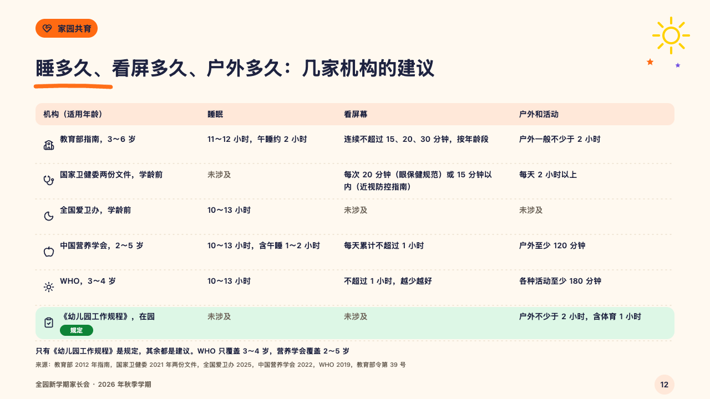
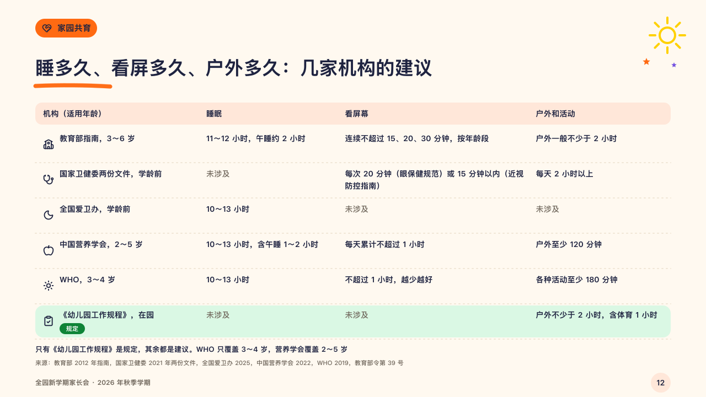

# crosscheck

What several bodies say about the same few things, side by side.

Code: [`src/layouts/compositions/crosscheck.tsx`](../../../src/layouts/compositions/crosscheck.tsx). The header comment there is the contract. The crayonbox setting only.

## crayon, new term parents' meeting sample, 2026-10

Settled on p12. The round's decisions are in [2026-10-08-crayon](../../rounds/2026-10-08-crayon/README.md).

| board (p12) | engine |
| :-: | :-: |
|  |  |

**What it looks like.** A pale band of the section's crayon carries the column names (14px). Under it a row a body, its symbol and its name (who it applies to) in the first column and what it says in each of the others (14/22, two lines at most), rows parted by a dotted line. A cell that gives no figure where the rest of its column does (「未涉及」, "Not covered") steps back into the grey. The one binding row (the row's `highlight`) sits on a pale green with its tag (「规定」) stamped under its name in the leaf green. The table's own `source` is a line of ink under it.

**Why.** Advice from five bodies and one rule look alike in a table, so the rule is the only row that is stamped and tinted, and the bodies that say nothing step back.

**What it gave up.**

- Takes an untitled `data_table` of three to five columns and two to six rows, every row with a symbol, at most one highlighted, a tag with words alone and only on that row.
- A column's mark or symbol, a total row, a cell past two lines or a closing line past one send the page back.
- The columns after the first share the room by the square root of their widest cell, close to the board's widths.
