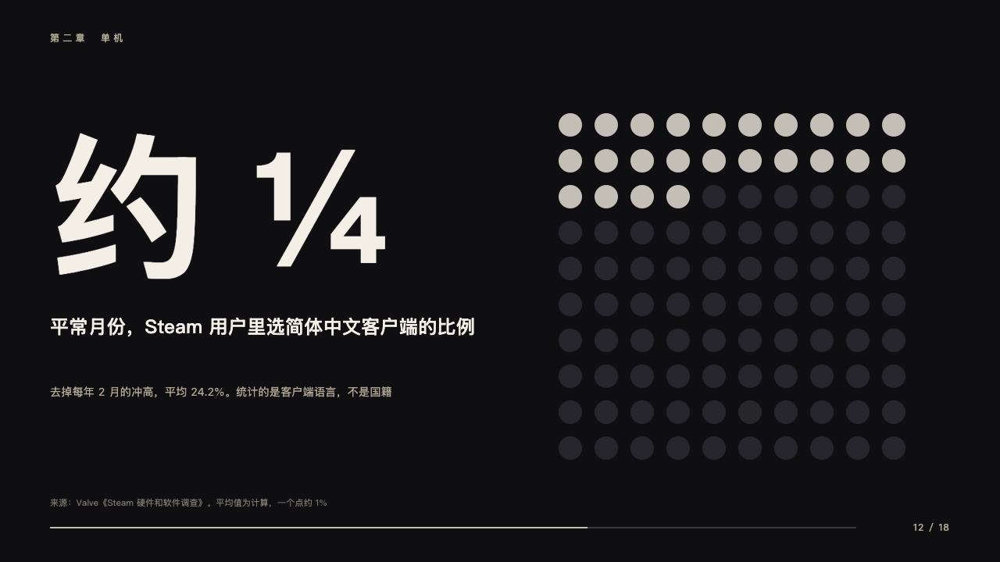
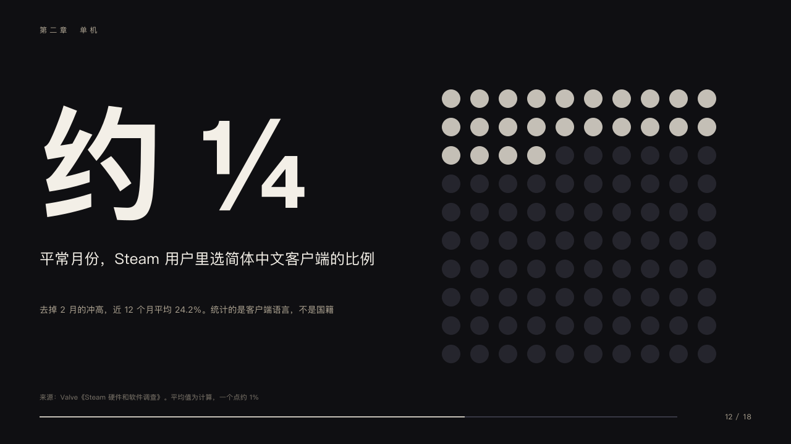

# crowd

A fraction as a hundred dots.

Code: [`src/layouts/compositions/crowd.tsx`](../../../src/layouts/compositions/crowd.tsx). The header comment there is the contract. The keynote setting only.

## stage, game developers keynote sample, 2026-10

Settled on p12. The round's decisions are in [2026-10-08-stage](../../rounds/2026-10-08-stage/README.md).

| board (p12) | engine |
| :-: | :-: |
|  |  |

**What it looks like.** At the left the figure bold at 200px from y150, the claim at 24/38 in the paper white from y400, the label at 14/24 in the sand from y490. At the right ten by ten dots 15px in radius every 46px from (730, 160), lit in silver from the top left.

**Why.** 「About a quarter」 is easier to believe when the room can count it.

**What it gave up.**

- The figure is written as a fraction (「约 ¼」, 「1 in 4」). The dots lit are the one percentage its label states (24.2% lights 24), else the fraction. A percentage alone may be a rate of growth, not a share, and is left to `giant`.
