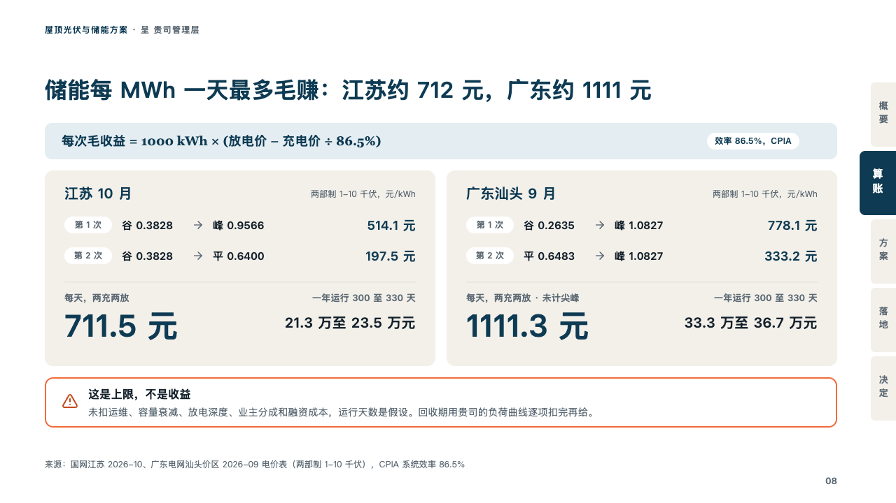
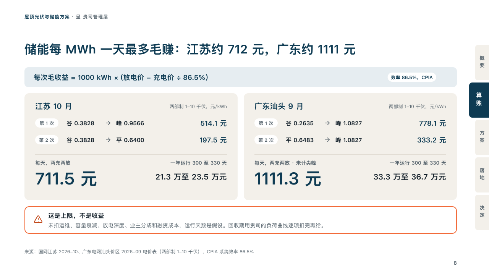

# cycles

What a store of energy earns a day, worked out place by place.

Code: [`src/layouts/compositions/cycles.tsx`](../../../src/layouts/compositions/cycles.tsx). The header comment there is the contract. The binder setting only.

## proposal, rooftop solar and storage proposal sample, 2026-10

Settled on the storage sum page (p08). The round's decisions are in [rounds/2026-10-06-proposal](../../rounds/2026-10-06-proposal/README.md).

| board (p08) | engine |
| :-: | :-: |
|  |  |

**What it looks like.** Over the cards the formula on a bar of the pale petrol, bold in petrol, with what it rests on as a white chip at the right. A card of sand a place: its name at 20px in petrol, the unit at its right in small grey, then a line a cycle (the cycle's name as a white chip, what it buys at and sells at with an arrow between, what it earns at the right), a hairline, the day's figure at 44px in petrol with its label and note in small grey, and at the right the year's range bold. Under the cards, the warning in a box outlined in the tangerine, its icon in the darker tangerine.

**Why.** A battery's case is two trades a day. Writing each trade out, then the day and the year, shows the figure is a ceiling the proposal does not count as income.

**What it gave up.**

- Takes a `callout` with no title and a tag (the formula), a `comparison` of two columns with a title, whose rows are one to three cycles written "buy → sell：earns", the marked row and one labelled row, then a `callout` with a title and no tag.
- The arrow is drawn and the colon declared, not printed.
- A formula or chip past the bar, a name, cycle, figure or range past its card, or a warning past one line sends the page back.
