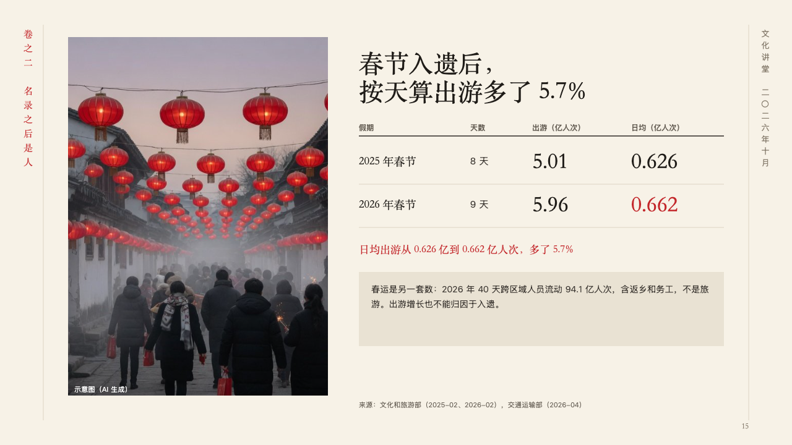

# daily

A small table that puts unlike periods on the same footing, beside a photograph.

Code: [`src/layouts/compositions/daily.tsx`](../../../src/layouts/compositions/daily.tsx). The header comment there is the contract. The scroll setting only.

## ink, intangible heritage public lecture sample, 2026-10

Settled on p15. The round's decisions are in [2026-10-07-ink](../../rounds/2026-10-07-ink/README.md).

| board (p15) | engine |
| :-: | :-: |
|  |  |

**What it looks like.** A photograph 420px wide runs the height of the page at the left, its note in white at its foot. Beside it the claim at 40px, in two lines where the author broke it, then an open table under a heavy rule: its first column in the heading face, its other words in the second ink, its figures set large in the heading face, hairlines between rows, and the figure the page turns on in cinnabar (in the row the author highlights, in the column the author marks or else the last column of figures). Under it the reading in cinnabar in the heading face (a `paragraph`) and an aside on a pale wash (a plain `callout`): what must not be compared with it. The source stands under the column.

**Why.** Two holidays of different lengths compare fairly only by the day, so the table sets the totals and the daily figure side by side, and the aside keeps the travel rush, a different count, out of the comparison.

**What it gave up.**

- Takes an `image`, a `data_table` of three to five columns, at least one all figures, and one to four rows, then optionally a `paragraph` and a `callout` with words alone, in that order.
- A table with a title, a source, a column's icon, a row's icon or tag or a total row, a callout with a title, a symbol or a tag, a cell, heading, reading or aside past its room, or a claim that does not fit beside the photograph sends the page back.
