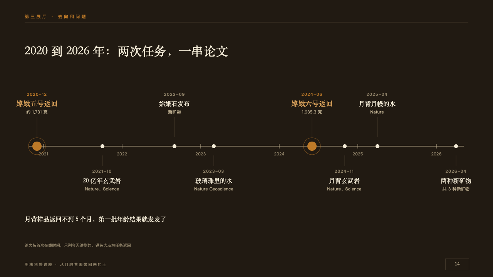
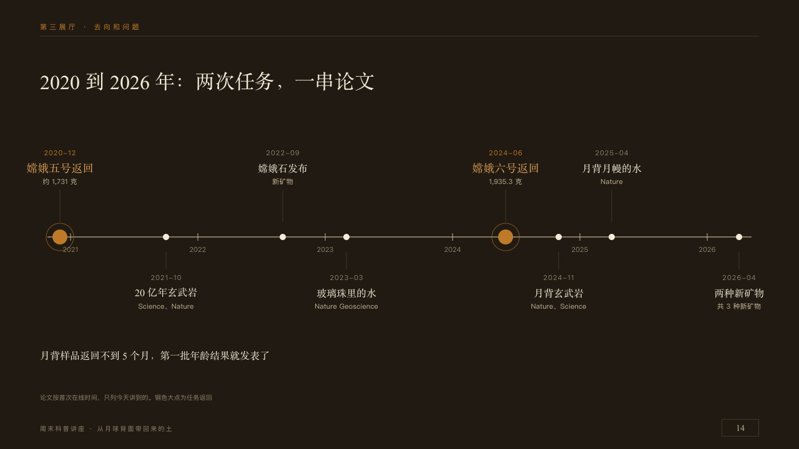

# dateline

Events at their true distance in time.

Code: [`src/layouts/compositions/dateline.tsx`](../../../src/layouts/compositions/dateline.tsx). The header comment there is the contract. The placard setting only.

## museum, Moon soil science talk sample, 2026-10

Settled on p14. The round's decisions are in [2026-10-08-museum](../../rounds/2026-10-08-museum/README.md).

| board (p14) | engine |
| :-: | :-: |
|  |  |

**What it looks like.** The claim over the page. One line from x76 to x1204 on y380 with a tick and the year at each new year. The events stand where their dates fall: a marked one (`highlight`) as a copper lamp 12px in radius ringed at 22px, the others as small dots of paper. Their words hang above and below the line in turn from a thin seam, 160px wide: the date at 11px tracked (copper on a lamp), the name in the serif at 16px (18px in the lit copper on a lamp), and a note at 11px in old paper. A closing line at 16px in the serif on y556.

**Why.** Less than five months between the far-side samples landing and the first ages being published only reads as fast when the months are drawn to scale.

**What it gave up.**

- Takes a `timeline` of three to ten milestones dated by year and month or by year, in order, with no icon, tag, tone, status, source, lane, title or periods.
- Two events on one side closer than their words sends the page back.
