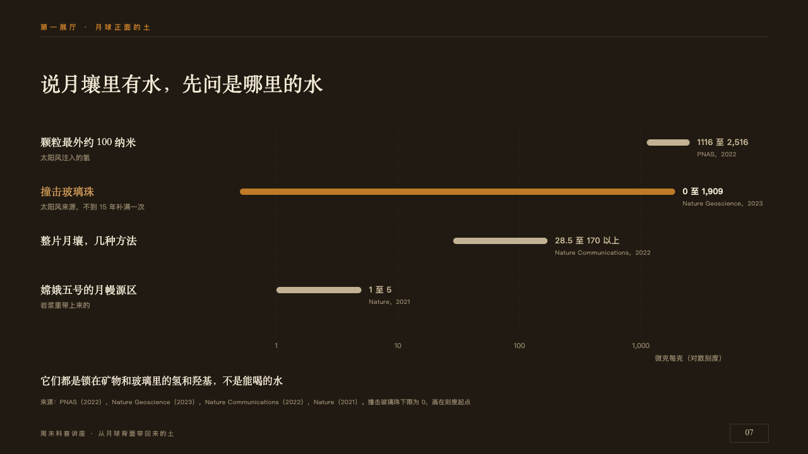
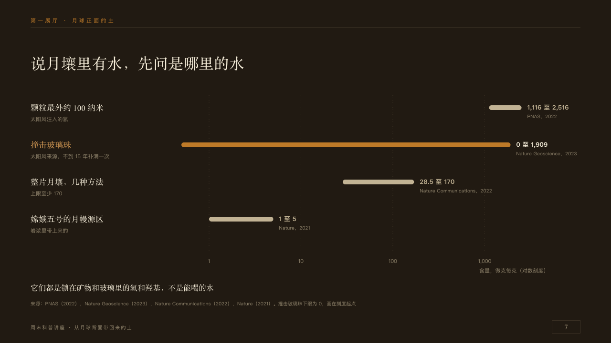

# decades

Ranges that span orders of magnitude, on one log scale.

Code: [`src/layouts/compositions/decades.tsx`](../../../src/layouts/compositions/decades.tsx). The header comment there is the contract. The placard setting only.

## museum, Moon soil science talk sample, 2026-10

Settled on p07. The round's decisions are in [2026-10-08-museum](../../rounds/2026-10-08-museum/README.md).

| board (p07) | engine |
| :-: | :-: |
|  |  |

**What it looks like.** The claim over the page. Each range a 10px round-ended bar from its low end to its high end on a log scale from x380 to x1150, dotted lines at each power of ten from y200 to y530 with their values under them and the scale named at the right: the series, its unit and 「（对数刻度）」. A row each 78px apart: its name at 17px in the serif, its second line small and dim, its two ends after the bar at 13px bold and where they come from under them. The marked range copper, its name in the lit copper. A range that starts at nothing starts at the scale's start. A closing line at 16px in the serif. With two figures after the chart (p12) the plot is tighter from x200, the names at 13px coloured like their bars, a copper band down the plot where the chart marks one, a line under the plot, a seam on y500, and the two figures at 36px in the serif side by side, each with its label tracked in copper over it and its note beside it, and a note under them.

**Why.** Water in the Moon's soil runs from one microgram a gram to two thousand: only a log scale shows every estimate and how far apart they are.

**What it gave up.**

- Takes a horizontal bar `chart` of one series of two to five ranges (`upper`) spanning two powers of ten or more, and a `paragraph`, or that and then a `kpi_cards` of two and a `paragraph`.
- The scale runs from two thirds of the lowest end above zero to half as much again as the highest, rounded out to 1, 2 or 5 of a power of ten.
- A range's description is the second line of its category, and where it comes from its `note`. The board's 「170 以上」 is written under the name.
- On p12 the unmarked ranges are both old paper, where the board set Chang'e-5's in paper.
