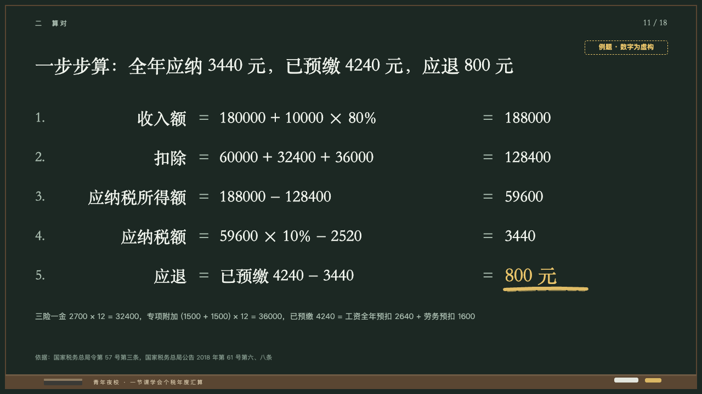
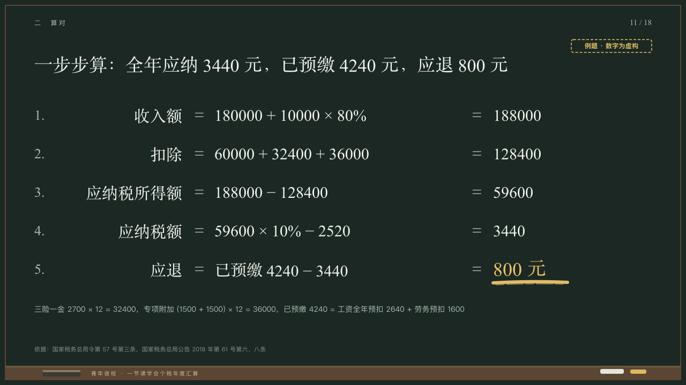

# derivation

A sum worked line by line, its equals signs in one column.

Code: [`src/layouts/compositions/derivation.tsx`](../../../src/layouts/compositions/derivation.tsx). The header comment there is the contract. The chalkboard setting only.

## lecture, annual tax reconciliation evening class sample, 2026-10

Settled on p11. The round's decisions are in [2026-10-08-lecture](../../rounds/2026-10-08-lecture/README.md).

| board (p11) | engine |
| :-: | :-: |
|  |  |

**What it looks like.** Lines from y190 every 72px in the serif: the number at 26px in the grey, what it works out at 30px right-aligned on x340, an equals sign in the grey centred on x372, the working at 30px from x400, an equals sign on x890 and the result at 30px from x920. The marked result is 36px in yellow with one stroke of yellow chalk under it. A line at 14/24 in the grey on where the inputs come from. The stamp at the top right.

**Why.** The way a teacher writes a derivation down a board, so the equals signs line up and the answer is underlined.

**What it gave up.**

- Takes a `bullets` of two to six lines, each written `what ＝ working ＝ result` (with 「＝」 or 「=」 and a space either side, drawn as written), at most one result marked, and optionally a `paragraph`.
