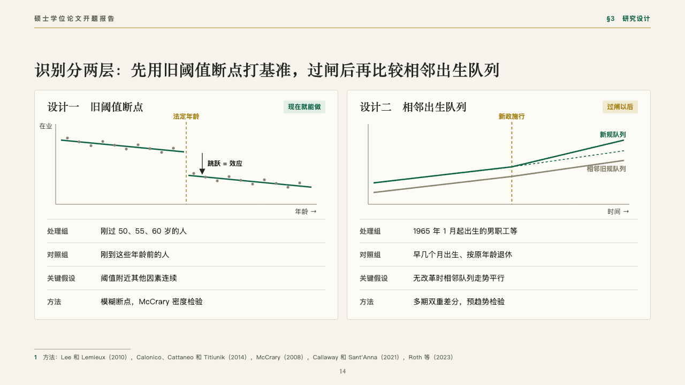
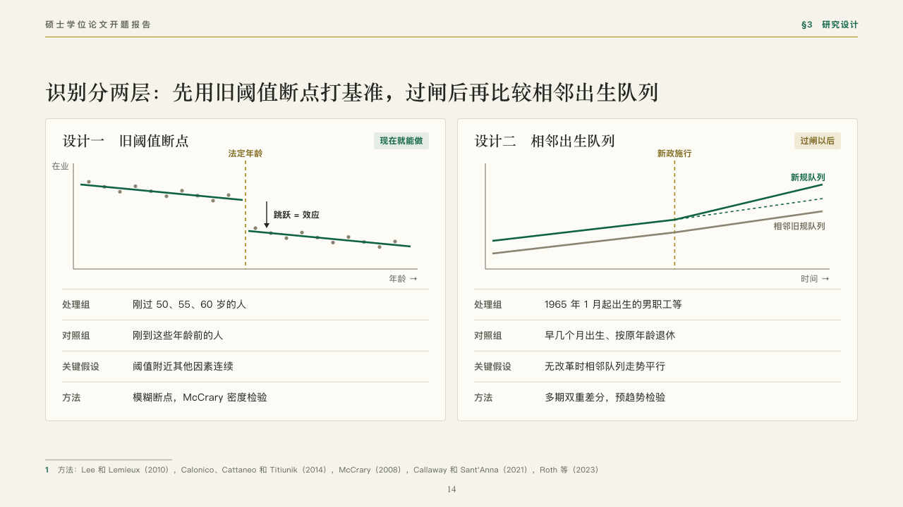

# designs

Two research designs side by side, each with its sketch.

Code: [`src/layouts/compositions/designs.tsx`](../../../src/layouts/compositions/designs.tsx). The header comment there is the contract. The manuscript setting only.

## thesis, retirement age thesis proposal sample, 2026-10

Settled on the identification page (p14). The round's decisions are in [rounds/2026-10-06-thesis](../../rounds/2026-10-06-thesis/README.md).

| board (p14) | engine |
| :-: | :-: |
|  |  |

**What it looks like.** A card a design: its name in the heading serif and when it can be done as a chip at the top right (pale emerald for the first, pale gold for the second), its sketch drawn small with a gold dashed line at the cutoff or the event, then its terms as ruled rows, each row's name small in the grey and what it says beside it.

**Why.** A committee judges a design by how it tells the effect apart. A sketch of the jump at the old threshold and of the two cohorts' diverging paths says it before the terms are read.

**What it gave up.**

- Takes a `comparison` of two columns written 「name · when」 and two to five rows, then two `sketch`es, one a column in the same order.
- A name, a chip or a row's words past one line sends the page back.
