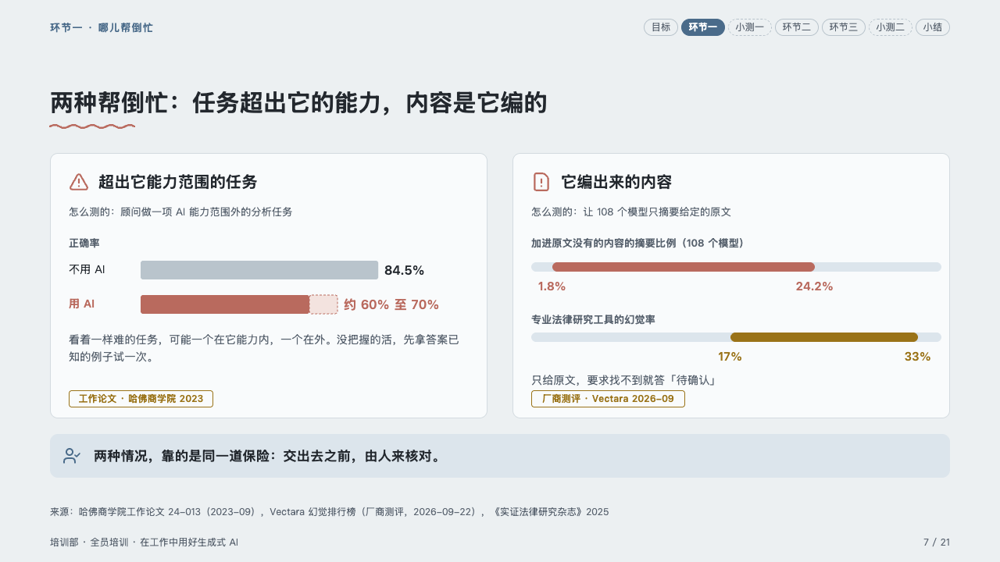
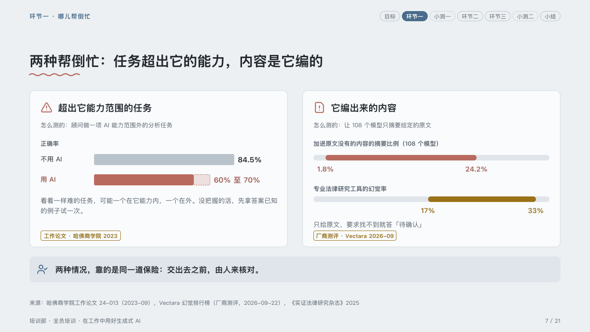

# diptych

Two studies side by side, each a card with its own figures.

Code: [`src/layouts/compositions/diptych.tsx`](../../../src/layouts/compositions/diptych.tsx). The header comment there is the contract. The lesson setting only.

## homeroom, AI-at-work training sample, 2026-10

Settled on the two ways it backfires page (p07). The round's decisions are in [rounds/2026-10-06-homeroom](../../rounds/2026-10-06-homeroom/README.md).

| board (p07) | engine |
| :-: | :-: |
|  |  |

**What it looks like.** Each card is an `insight_panel` and the `chart` after it: the panel's icon in the pen and its title bold at 20px, its rows as 「怎么测的：…」 lines, then the chart, then the panel's footnote as what to do about it, and the chart's tag at the foot as the kind of study. A chart with a plain bar is drawn as bars from zero, its axis title over them, the bar the page is about in the pen and the rest in the ghost, a value known only as a range (`upper`) solid to its low end and dashed on to its high end over the pen's tint. A chart whose every bar is a range is drawn as spans on a track, each named over it, the marked one in the pen and the others in the warning ink, their ends named under them. Under the two cards the one safety net they share, bold in a tip box.

**Why.** Two failures that look different end in the same remedy: setting them side by side, each with its own evidence, lets the bottom line say it once.

**What it gave up.**

- Two pairs of an `insight_panel` (one or two rows) and a horizontal bar `chart` of one series and two or three bars, then optionally a `callout`.
- The bar's range label reads 「60% 至 70%」. The board wrote 「约 60% 至 70%」: the engine names both ends and does not add words the author did not write.
- A title, a row or a bar's name past one line, a footnote past its lines or a pill wider than the card sends the page back.
