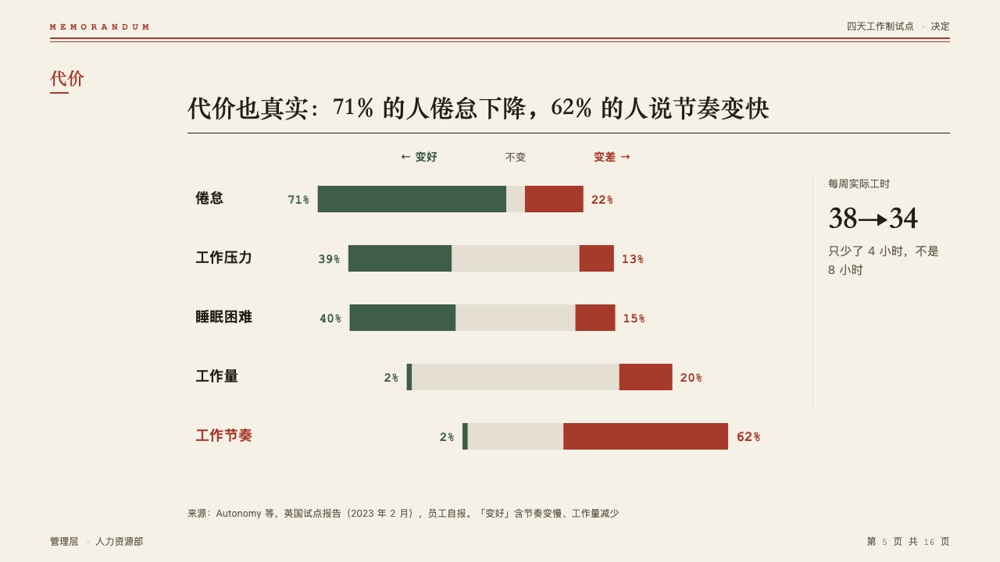
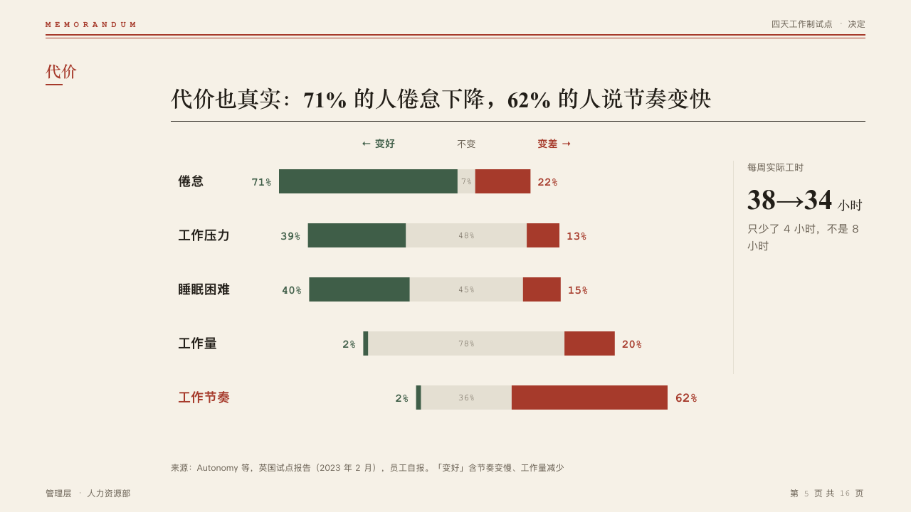

# diverging

Who got better and who got worse, as bars that run left and right from the middle, with an optional figure column.

Code: [`src/layouts/compositions/diverging.tsx`](../../../src/layouts/compositions/diverging.tsx).

## memo, four-day week decision sample, 2026-10

Settled on the cost page (p05). The round's decisions are in [rounds/2026-10-05-memo](../../rounds/2026-10-05-memo/README.md).

| board (p05) | engine |
| :-: | :-: |
|  |  |

**What it looks like.** One row a measure, 76px apart: the share that got better runs left from the middle in the success ink, the unchanged share straddles the middle in the hairline grey with its figure inside, the share that got worse runs right in the mark. Every share is printed in bold mono at the bar's end. The series' names with arrows head the rows. The marked row's name is in the mark and its worse share is larger. A figure column past a hairline: a small mono label, the figure at 40px in the heading face with its unit, and its note. The names column is 100px, wider for a longer name, up to a fifth of the band.

**Why.** "71% less burned out, 62% say the pace went up" is one page only when both directions are read off one middle.

**What it gave up.**

- One `percent_stacked` chart whose series say which side is which (`tone: "success"` and `tone: "danger"`, a third with no tone), two to six categories.
