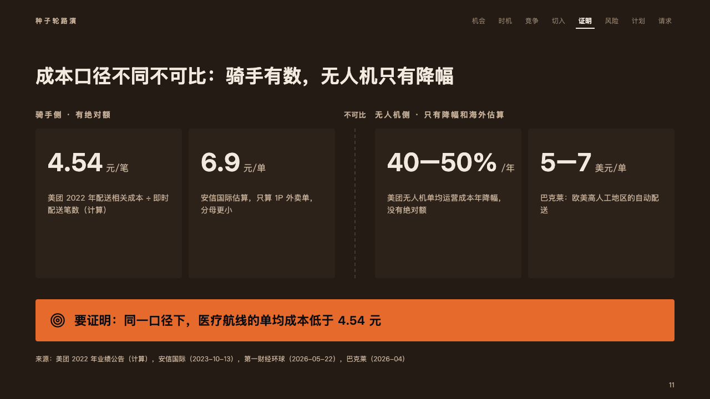

# divide

Two sets of figures that cannot be set against each other: two groups apart, a dashed line between, the conclusion in the fire.

Code: [`src/layouts/compositions/divide.tsx`](../../../src/layouts/compositions/divide.tsx). The header comment there is the contract. The pitch setting only.

## ember, low-altitude delivery pitch sample, 2026-10

Settled on the unit cost page (p11). The round's decisions are in [rounds/2026-10-06-ember](../../rounds/2026-10-06-ember/README.md).

| board (p11) | engine |
| :-: | :-: |
|  |  |

**What it looks like.** The figures fall into two groups by the tag they share (「骑手侧 · 有绝对额」, "Courier side · absolute figures"), each group named at 14px bold and tracked in the warm grey over its cards, a dashed line down between the groups. A card is 270px tall: a figure at 46px bold with its unit at 16px in the warm grey after it, and what it measures at 14px in up to three lines. Under the cards the conclusion as a bar of the fire 76px tall, its icon and its words at 22px bold in the dark ink.

**Why.** The page's argument is that the two sides cannot be compared yet. Keeping them apart, with nothing lit but what has to be proved, says that more honestly than one chart would.

**What it gave up.**

- A `kpi_cards` of two to six items in two runs of one to three, every item in a run with the same tag (no basis or evidence on it) and no delta, tone, icon, note or source, no figure marked, then optionally a `verdict_banner` of neutral tone.
- Every figure is set at the board's 46px, or at 40 or 36px all together when one of them is wider than its card at 46.
- The board printed 「不可比」 over the dashed line. The engine prints no words the author did not write.
- A group's name wider than its group, a figure wider than its card even at 36px, what it measures past three lines, or a conclusion past one line sends the page back.
