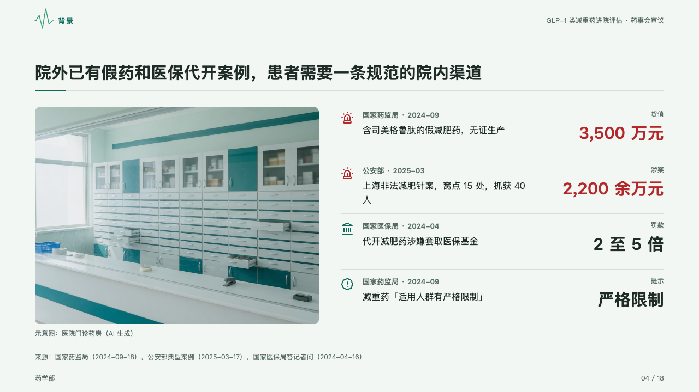
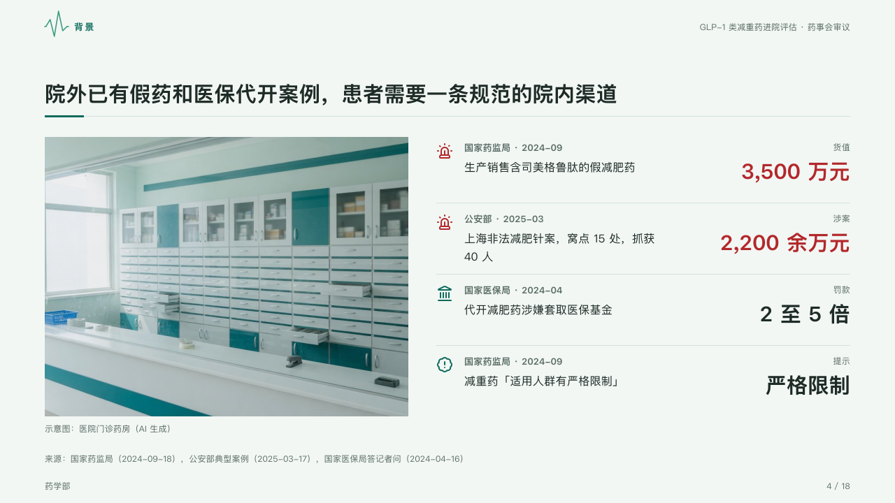

# docket

Cases on file, one a row: who reported it and when, what happened, and the figure the case turns on.

Code: [`src/layouts/compositions/docket.tsx`](../../../src/layouts/compositions/docket.tsx). The header comment there is the contract. The dossier setting only.

## clinic, GLP-1 formulary review sample, 2026-10

Settled on the outside-risk page (p04), beside a photograph set by `inset`. The round's decisions are in [rounds/2026-10-05-clinic](../../rounds/2026-10-05-clinic/README.md).

| board (p04) | engine |
| :-: | :-: |
|  |  |

**What it looks like.** One row a case, parted by hairlines: its icon at the left, who reported it and when (the item's `source`, 「国家药监局 · 2024-09」) at 13px bold in the muted ink, what happened (its `note`) at 16px under it, up to two lines, and at the right the figure the case turns on bold at 30px, what the figure is (its `label`: 「货值」「涉案」「罚款」) at 12px over it. A case that is bad news (`tone: "danger"`) sets its icon and its figure in the danger ink.

**Why.** A committee weighs a risk by its cases on record: who found it, when, and how much was at stake.

**What it gave up.**

- One `kpi_cards` of two to five items, each with an icon and a source and none with a delta or a tag.
- A figure wider than its column, a source past one line, a note past two lines, or rows taller than the band send the page back.
