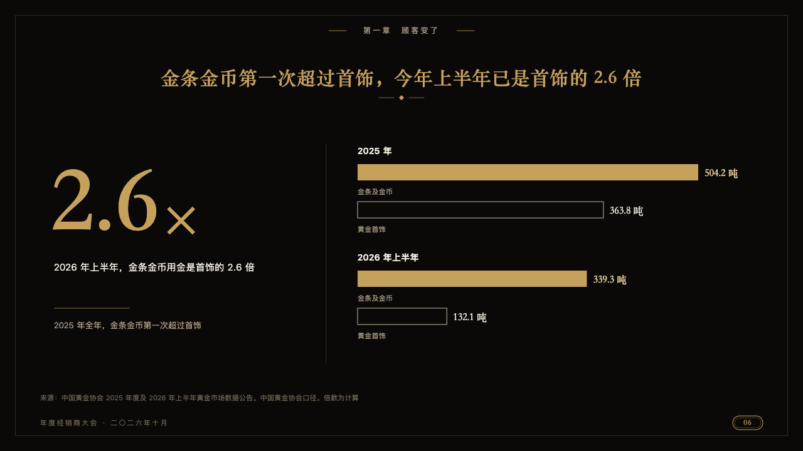
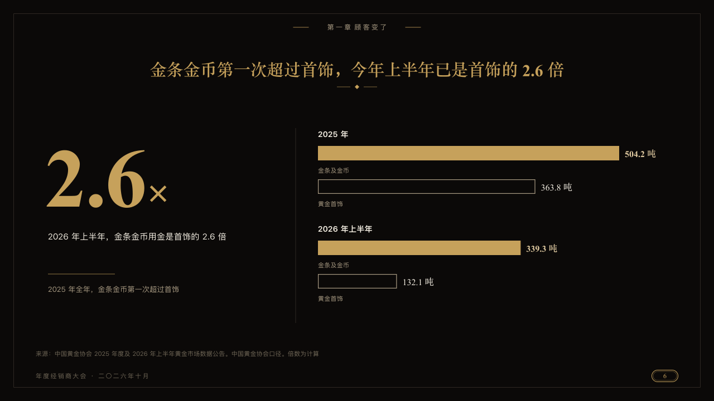

# doubles

Two quantities side by side in each of one or two periods, as pairs of bars on their side.

Code: [`src/layouts/compositions/doubles.tsx`](../../../src/layouts/compositions/doubles.tsx). The header comment there is the contract. The invitation setting only.

## luxe, gold dealer conference sample, 2026-10

Settled on p06. The round's decisions are in [2026-10-08-luxe](../../rounds/2026-10-08-luxe/README.md).

| board (p06) | engine |
| :-: | :-: |
|  |  |

**What it looks like.** Each period named in bold ivory over its pair: the first series a solid gold bar, the second an outline in old gold, each with its value and unit past its end in the serif and its series' name small under it. Both pairs read on one scale.

**Why.** Which overtook which is a comparison of two lengths. The outline keeps the quieter one from competing with the gold.

**What it gave up.**

- Takes a `bar` chart on its side of two series over one or two categories, every value above zero, in a band another composition hands on or on a page of its own.
- Any other chart mark, or a name or value past its room, sends the page back.
