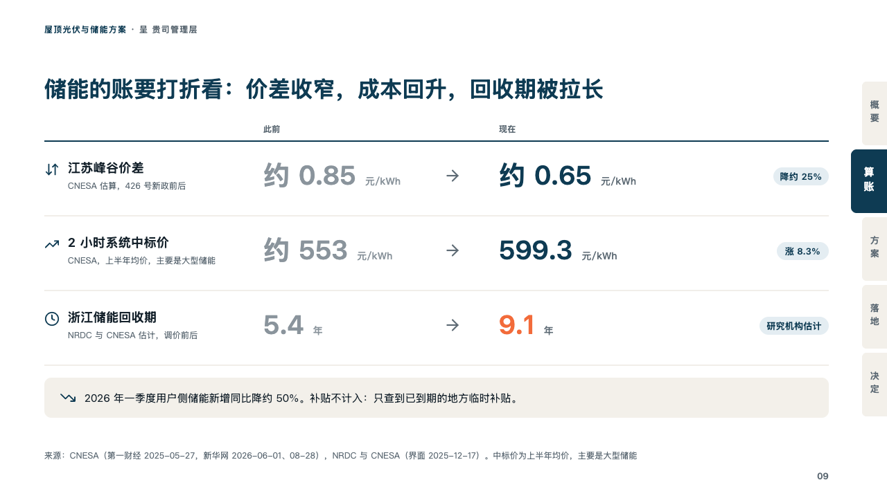
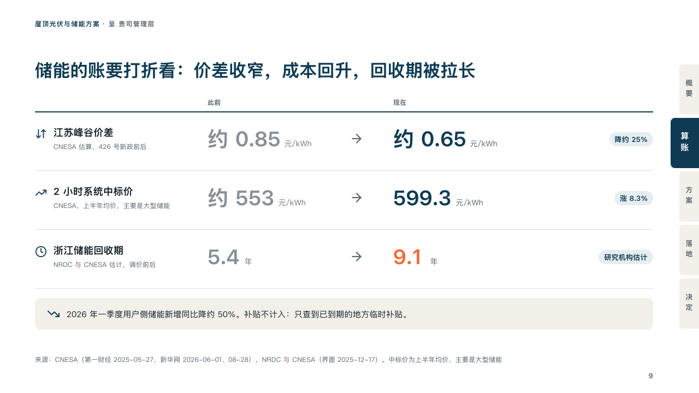

# drift

How far a few measures have moved, from before to now.

Code: [`src/layouts/compositions/drift.tsx`](../../../src/layouts/compositions/drift.tsx). The header comment there is the contract. The binder setting only.

## proposal, rooftop solar and storage proposal sample, 2026-10

Settled on the storage discount page (p09). The round's decisions are in [rounds/2026-10-06-proposal](../../rounds/2026-10-06-proposal/README.md).

| board (p09) | engine |
| :-: | :-: |
|  |  |

**What it looks like.** Over the rows the two states' names in small grey. A row a measure under a rule: its icon in petrol, its name bold over its note in small grey, the value it had at 38px in a faded grey, an arrow, the value it has now at 38px in petrol (the measure the page is about in the tangerine), each with its unit small after it, and what the move is as a pale petrol chip at the right. Under the rows a bar of sand with the note's icon and one line.

**Why.** A storage case is being discounted by three moves at once. Setting the old value faded beside the new one makes each move readable at a glance.

**What it gave up.**

- Takes a `from_to` of three or four rows, each with an icon, with no change, label column, span or state kickers and at most one row marked, then optionally a `callout` with no title or tag.
- A name, note, value or chip past its column, or a note past one line sends the page back.
