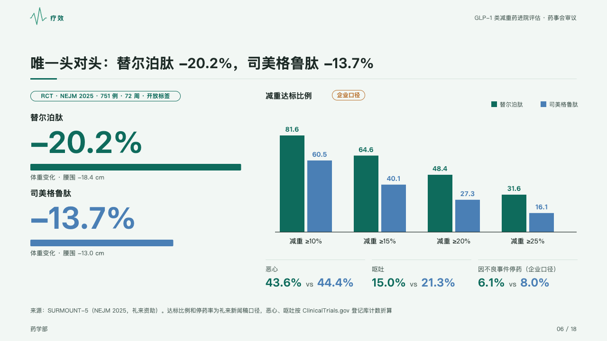

# duel

Two options head to head in one trial: their headline figures, their shares reaching each target as grouped columns, and a row of small comparisons.

Code: [`src/layouts/compositions/duel.tsx`](../../../src/layouts/compositions/duel.tsx). The header comment there is the contract. The dossier setting only.

## clinic, GLP-1 formulary review sample, 2026-10

Settled on the head-to-head page (p06), under the page's tag. The round's decisions are in [rounds/2026-10-05-clinic](../../rounds/2026-10-05-clinic/README.md).

| board (p06) | engine |
| :-: | :-: |
|  |  |

**What it looks like.** At the left each option's name bold, its headline figure at 64px in its own ink (the mark, then vein blue) over a 14px bar as long as the figure is large, and its note under it. At the right the chart's title bold with its tag beside it (「企业口径」 in brown), the legend at the right, and the grouped columns with their values over them. Along the foot of the right column a row of small figures, each 「a vs b」 in the two options' inks under its measure's name, from a `data_table` whose value columns are named as the chart's series are.

**Why.** A head-to-head is the one comparison two drugs allow, so both stand on one page in two inks that run through every figure.

**What it gave up.**

- `kpi_cards` of two items, an upright `bar` chart of two series and two to five categories, and a `data_table` of one to three rows, in that order, every name matching.
- A chart with changes, bands, tones or marks, or a table with a title, tags, icons or marked rows, sends the page back.
