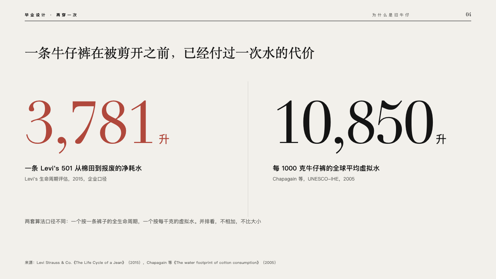
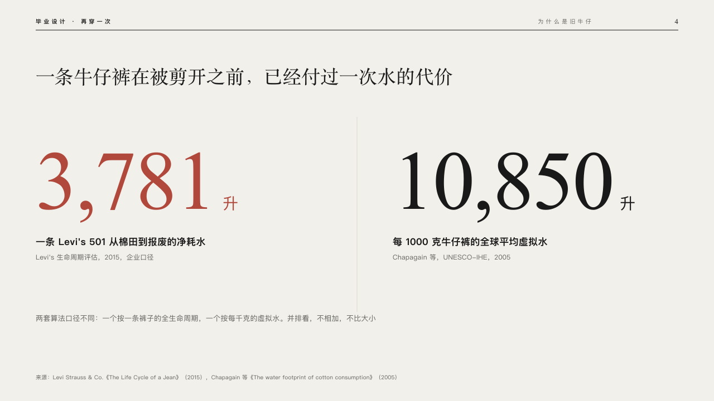

# duet

Two figures set huge side by side and never added.

Code: [`src/layouts/compositions/duet.tsx`](../../../src/layouts/compositions/duet.tsx). The header comment there is the contract. The lineup setting only.

## runway, graduation collection review sample, 2026-10

Settled on p04. The round's decisions are in [2026-10-08-runway](../../rounds/2026-10-08-runway/README.md).

| board (p04) | engine |
| :-: | :-: |
|  |  |

**What it looks like.** The claim over the page. Each figure at 150px in the serif, closed up 3px, its unit at 28px after it in the body sans, what it counts at 17px in bold under it, and where it comes from at 12px in the stone grey under that. A hairline stands between the two. The marked figure (`**…**`) is crimson. A line on why they stand apart closes the page at 13/22 in the stone grey. One figure stands alone at the left.

**Why.** Two figures counted two ways belong on one page, read side by side and never added or drawn to one scale.

**What it gave up.**

- Takes a `kpi_cards` of one or two items with labels and no icon, delta, tag, tone or note, then optionally a `paragraph`.
- A figure wider than its half, a label or a source past two lines, or a closing line past two sends the page back.
