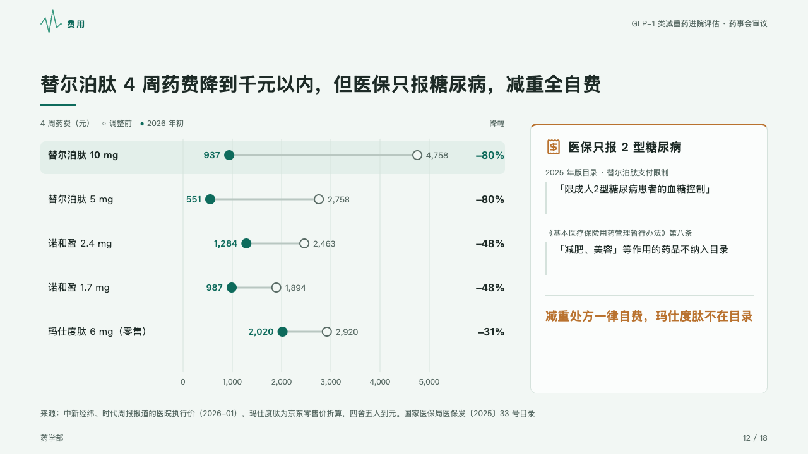
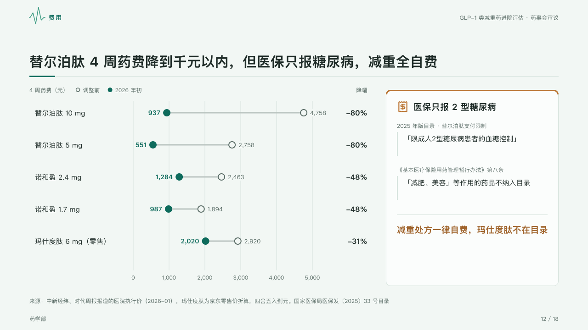

# dumbbells

What each thing cost before and after: a hollow dot, a solid dot in the mark and the change at the right, beside the reminder that goes with the figures.

Code: [`src/layouts/compositions/dumbbells.tsx`](../../../src/layouts/compositions/dumbbells.tsx). The header comment there is the contract. The dossier setting only.

## clinic, GLP-1 formulary review sample, 2026-10

Settled on the cost page (p12). The round's decisions are in [rounds/2026-10-05-clinic](../../rounds/2026-10-05-clinic/README.md).

| board (p12) | engine |
| :-: | :-: |
|  |  |

**What it looks like.** One row 70px an item: its name, a hollow dot where it stood before and a dot in the mark where it stands now, a 3px ghost line between them, each dot's figure on its outer side, and at the right the change as a share of where it started (−80%). The header names the axis and its unit and keys the two dots by the series' names; the axis is ticked under the rows, and the grid breaks under each figure. Beside the rows a panel with a 3px top edge, its icon and its last line in the warning ink, each row a small label over a quoted line set off by a rule.

**Why.** A price cut is read as distance travelled, and the reminder that insurance does not cover the use is the cost the room must not forget.

**What it gave up.**

- A `dumbbell` chart of two series and two to five rows with positive figures, then optionally an `insight_panel` of one to three rows.
- No row tint: a dumbbell chart has no field that marks the row a page is about, so the board's marked first row is not drawn.
