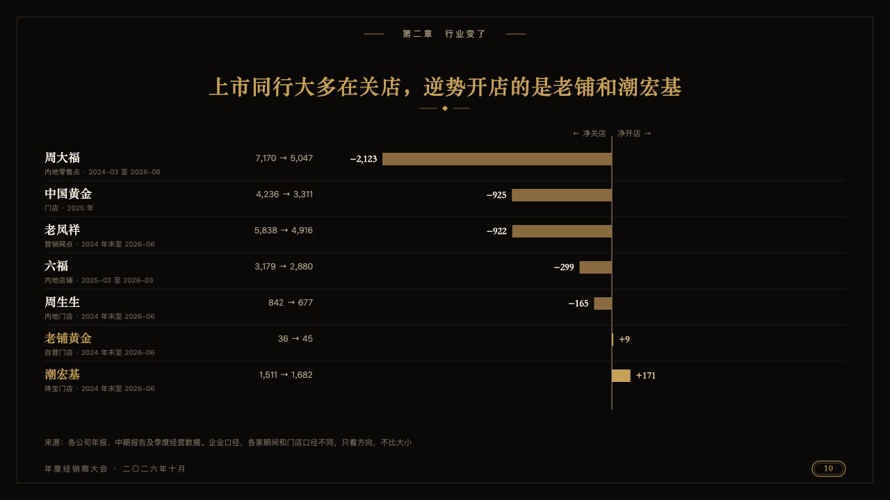
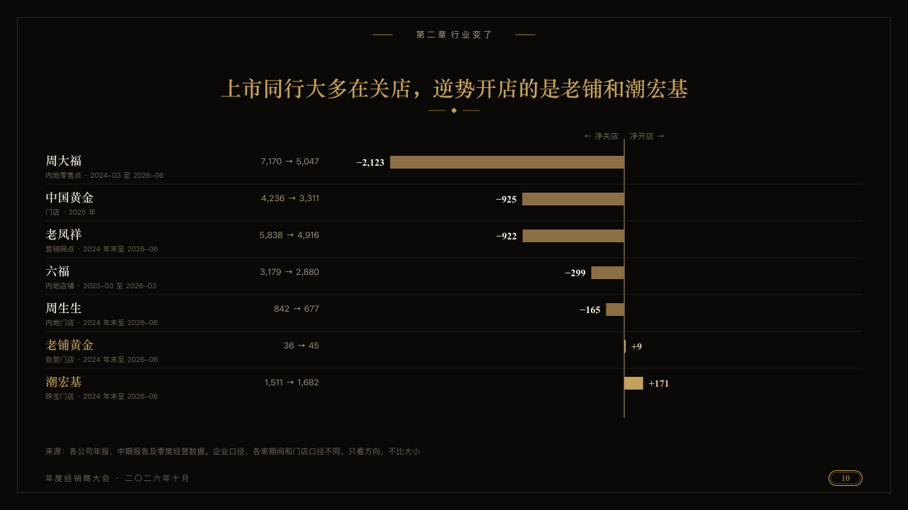

# ebb

What each house closed and what it opened, as bars that run left and right from one line.

Code: [`src/layouts/compositions/ebb.tsx`](../../../src/layouts/compositions/ebb.tsx). The header comment there is the contract. The invitation setting only.

## luxe, gold dealer conference sample, 2026-10

Settled on p10. The round's decisions are in [2026-10-08-luxe](../../rounds/2026-10-08-luxe/README.md).

| board (p10) | engine |
| :-: | :-: |
|  |  |

**What it looks like.** One row a house: its name in the serif (ivory where it closed, gold where it opened), what its figure counts and over which stretch small under it (the parenthesis its category closes with), its first and last count right-aligned beside it (the point's `note`), and its bar from the line down the middle, bronze to the left for the first series and gold to the right for the second, its figure past its end. The series' names stand over the line with arrows.

**Why.** Closures and openings are two directions of one measure. A shared zero line keeps the few that opened from vanishing among the many that closed.

**What it gave up.**

- Takes a `bar` chart on its side of two series, the first at or below zero and the second at or above it, three to seven rows in all.
- Series that share a category or run the wrong way, or a name, period, note or figure past its room, sends the page back.
