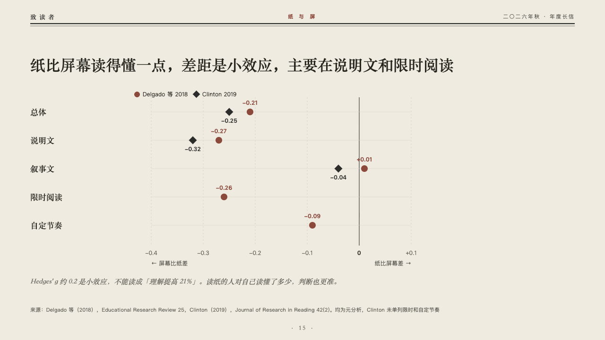
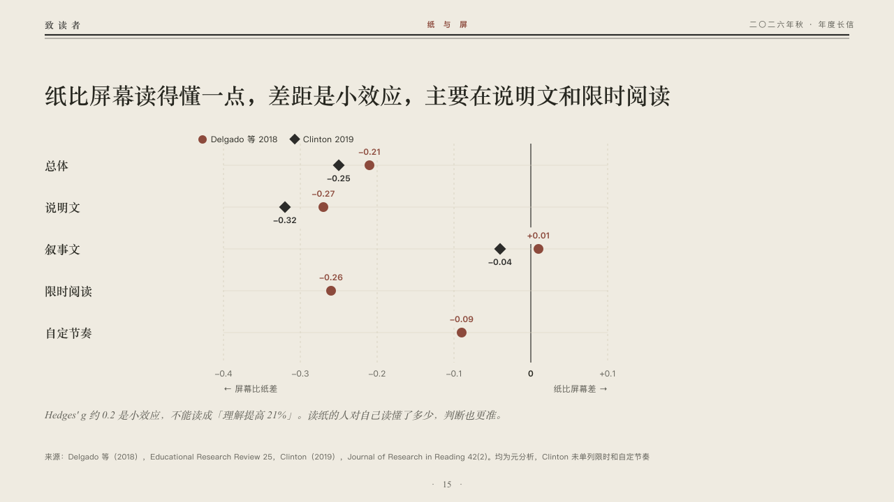

# effects

Effect sizes from two studies on one scale.

Code: [`src/layouts/compositions/effects.tsx`](../../../src/layouts/compositions/effects.tsx). The header comment there is the contract. The periodical setting only.

## journal, annual letter to readers sample, 2026-10

Settled on p15. The round's decisions are in [2026-10-07-journal](../../rounds/2026-10-07-journal/README.md).

| board (p15) | engine |
| :-: | :-: |
|  |  |

**What it looks like.** The claim over the page. Under it a key of the two studies, a row a condition named in the heading serif, the first study's estimate as a brick red dot with its value over it, the second's as an ink diamond with its value under it. The scale runs over the two ranges the author marked (`bands`): a solid zero line, a dashed hairline every tenth, the ticks under the plot with their signs, and each range's name at its own end saying what a value there means. An italic line under the plot.

**Why.** Hedges' g of about 0.2 is a small effect, not 21% better understanding. The values print as effect sizes with their signs, never as percentages, and the two named sides say which way is worse.

**What it gave up.**

- Takes an untitled bar chart on its side of one or two series over two to five categories, the first series on every category, with two bands that meet at zero (`bands` on a bar chart on its side), then optionally a `callout` with words alone.
- The zero line is cut clear of a value that sits on it.
- A value outside the bands, a tag, gaps, changes, a reference, notes, symbols or statuses send the page back or leave the chart to the ordinary renderer.
