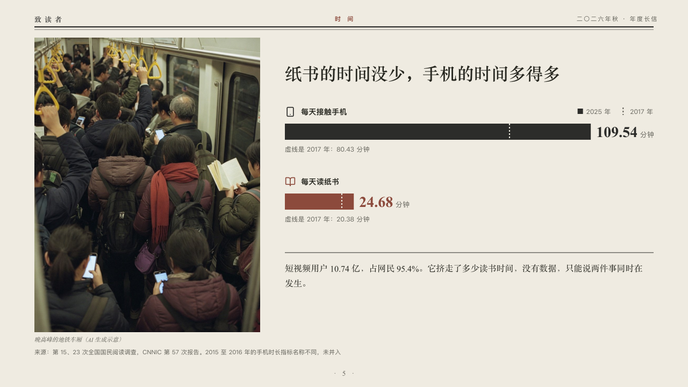

# elapsed

How long a day's habits run now against an earlier year, beside a photograph that runs up to the masthead.

Code: [`src/layouts/compositions/elapsed.tsx`](../../../src/layouts/compositions/elapsed.tsx). The header comment there is the contract. The periodical setting only.

## journal, annual letter to readers sample, 2026-10

Settled on p05. The round's decisions are in [2026-10-07-journal](../../rounds/2026-10-07-journal/README.md).

| board (p05) | engine |
| :-: | :-: |
|  |  |

**What it looks like.** A photograph the height of the page at the left, up to the masthead, its plain caption under it, and the claim beside it at the right. Under the claim a row a habit: its symbol and name, a bar as long as it runs now, a dashed cut across the bar where it stood in the earlier year, its figure after the bar large in the heading serif with its unit small, and the author's line for the earlier year under the bar. The marked habit is in brick red. A small key on the first row's line names the two years. A closing paragraph under a rule.

**Why.** The page argues that print held its time while the phone took far more. The earlier year belongs on the same bar, not on a second one.

**What it gave up.**

- Takes an `image`, an untitled bar chart on its side of two series over one to three categories (the earlier year first, every earlier value no longer than now, its symbols and notes on the first series), and a `paragraph`.
- The key is the engine's: the two series' names reach the page there. The board drew none.
- A claim that does not fit beside the photograph, or a name, figure, note, caption or paragraph past its room, sends the page back.
