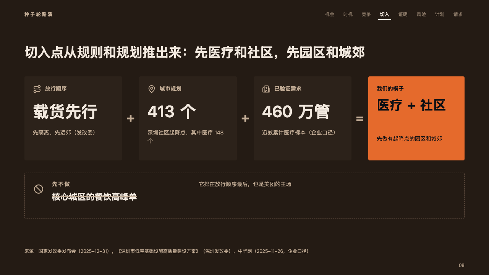
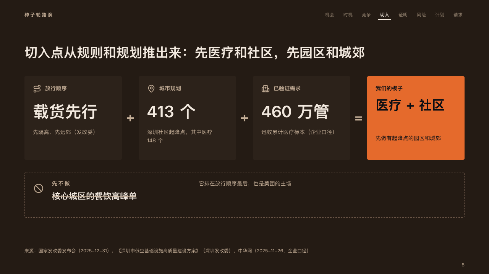

# equation

Where a pitch cuts in, worked out as a sum: the terms as cards, the result in the fire, and what it leaves out struck through.

Code: [`src/layouts/compositions/equation.tsx`](../../../src/layouts/compositions/equation.tsx). The header comment there is the contract. The pitch setting only.

## ember, low-altitude delivery pitch sample, 2026-10

Settled on the wedge page (p08). The round's decisions are in [rounds/2026-10-06-ember](../../rounds/2026-10-06-ember/README.md).

| board (p08) | engine |
| :-: | :-: |
|  |  |

**What it looks like.** Each term a card 220px tall: its icon and its name at 14px in the warm grey, its figure at 42px bold, a note under it at 14px. A plus between the cards and an equals before the result, at 34px in the warm grey. The result is a card of the fire: its name, its figure at 34/46 in up to two lines (「医疗 + 社区」, "Medical + community") and its note, all in the dark ink. Under the sum a dashed outline 120px tall holds what the result leaves out on purpose (`excluded`): its icon, its name small and tracked in the warm grey with why beside it, and the thing itself at 22px bold, struck through.

**Why.** A wedge is a deduction: the order the rules allow, the city's plan and demand already proven add up to one place to start. Saying what comes later is half of that decision.

**What it gave up.**

- A `concept_equation` of two or three terms and a result, each with a figure, optionally an `excluded`.
- The strike is a line the engine draws over the thing's width (`data-strike`), not a font effect.
- A term's name past one line, a figure wider than its card, a note past two lines, a result's figure past two lines, or an exclusion whose name, why or thing does not fit its line sends the page back.
