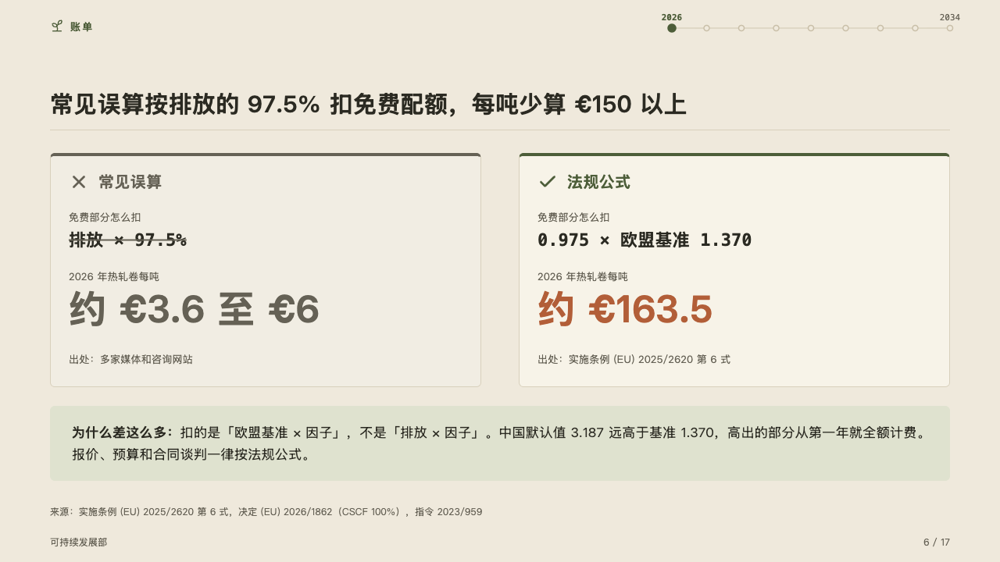
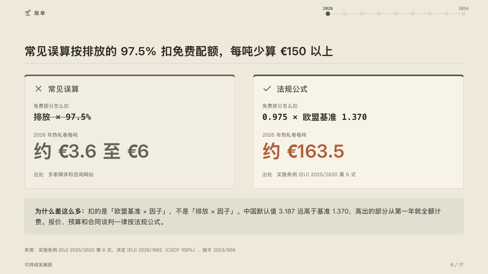

# errata

A sum worked the wrong way beside the right way.

Code: [`src/layouts/compositions/errata.tsx`](../../../src/layouts/compositions/errata.tsx). The header comment there is the contract. The yearbook setting only.

## almanac, CBAM sample, 2026-10

Settled on the miscalculation page (p06). The round's decisions are in [rounds/2026-10-05-almanac](../../rounds/2026-10-05-almanac/README.md).

| board (p06) | engine |
| :-: | :-: |
|  |  |

**What it looks like.** Two cards side by side, one for each column of a `comparison`. The column the page recommends sits on the card, a check before its name and a 4px top edge in the mark. The other sits on a card a step under the page, a cross before its name, its edge and name in the muted ink. Each card takes the rows in order: the working (every row before the marked one) as a muted label over its value in mono, struck through on the wrong card, then the marked row (`emphasis`) as its label over the figure at 48px, in the accent on the right card and muted on the wrong one, then a last row as one quiet line, its label and its value set apart. Under the cards a band on the mark's tint says why the two differ.

**Why.** A shortcut that many sources repeat is answered by working it through, crossed out, beside the legal sum, so the reader sees the step where they part and the size of the difference.

**What it gave up.**

- A `comparison` of two columns with one recommended, two to four rows with one marked, no row icon or tag, no title, label column or tag column. Then optionally one `callout` with no icon, title or tag.
- A value past its card, a figure wider than its card, a note past two lines, or anything taller than the band sends the page back.
- The last row's label and value are set apart with no colon (「出处 多家媒体和咨询网站」), where the board wrote 「出处：」.
