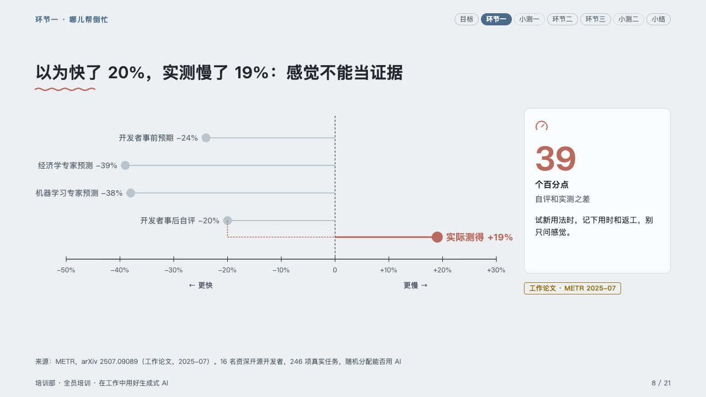
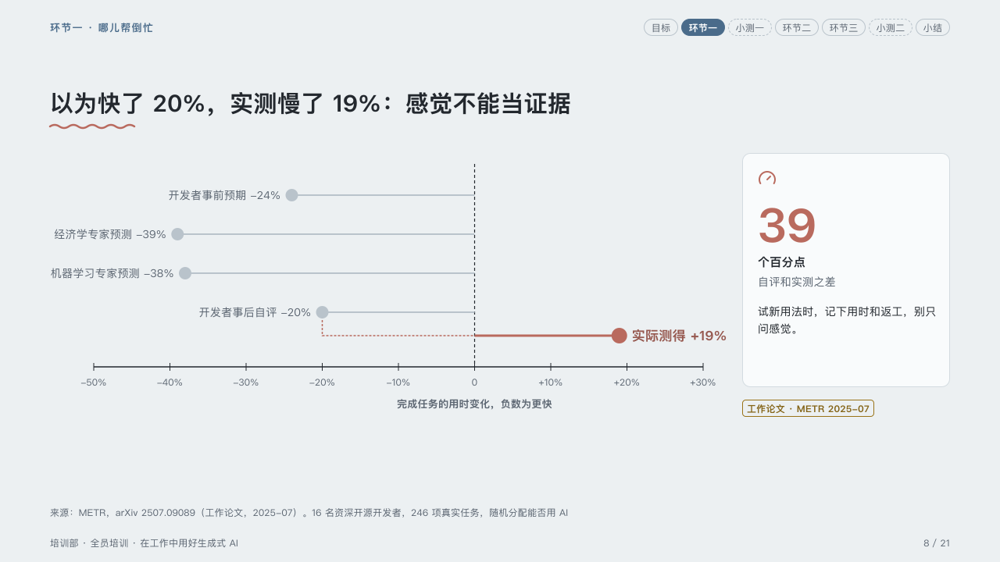

# estimates

What people expected against what was measured, on one axis through zero.

Code: [`src/layouts/compositions/estimates.tsx`](../../../src/layouts/compositions/estimates.tsx). The header comment there is the contract. The lesson setting only.

## homeroom, AI-at-work training sample, 2026-10

Settled on the felt-against-measured page (p08). The round's decisions are in [rounds/2026-10-06-homeroom](../../rounds/2026-10-06-homeroom/README.md).

| board (p08) | engine |
| :-: | :-: |
|  |  |

**What it looks like.** Each expectation a grey dot on a grey stem from zero, its name and value beside it; the measurement, the bar the author marks, a dot in the pen on a heavy stem, named in the pen. A dashed bracket in the pen runs from the expectation just before it down to the measurement's row and along to zero. Ticks every ten points under the axis (every twenty on a scale wider than a hundred), a dashed line up from zero, the axis title under the ticks. Beside the plot a card states the gap: its icon and figure in the pen at 60px, the unit bold, what it is muted, what to do about it, and the kind of study as a pill under the card. The plot narrows from either end until every name beside its dot clears the band and the card.

**Why.** A feeling and a measurement on one axis make the gap the argument, without a second chart.

**What it gave up.**

- A horizontal bar `chart` of one series of three to six bars, the last one marked and the others not, then optionally a `kpi_cards` of one item.
- The board's direction words 「← 更快」 and 「更慢 →」 are left out: the chart's own axis title under the ticks says which way is faster. A chart has no field for two direction words.
- A mark on any bar but the last, or a name that cannot clear the band at the narrowest plot, sends the page back.
