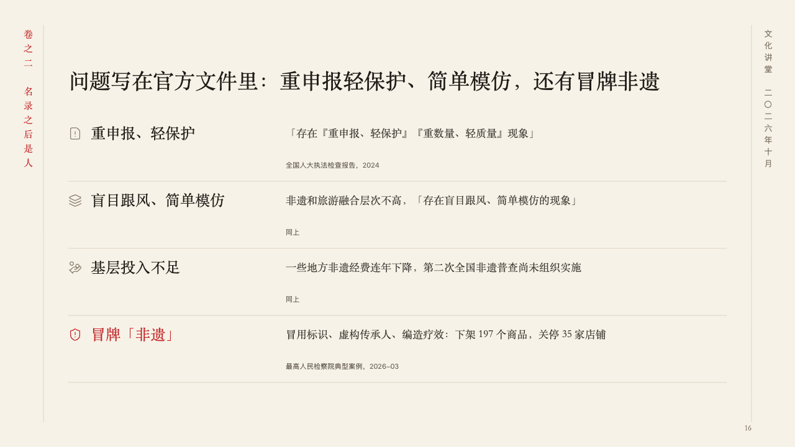
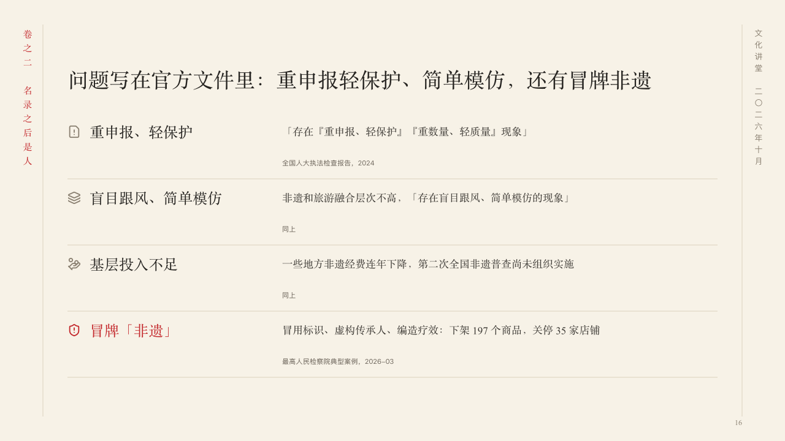

# excerpts

Findings quoted from the record, with their sources.

Code: [`src/layouts/compositions/excerpts.tsx`](../../../src/layouts/compositions/excerpts.tsx). The header comment there is the contract. The scroll setting only.

## ink, intangible heritage public lecture sample, 2026-10

Settled on p16. The round's decisions are in [2026-10-07-ink](../../rounds/2026-10-07-ink/README.md).

| board (p16) | engine |
| :-: | :-: |
|  |  |

**What it looks like.** The claim over the page. Under it a ruled row a finding: its symbol and its name in the heading face at the left, and at the right the record's own words in the heading face in the second ink, with where they come from under them, small in the grey (the card's tag). The finding the author marks (its whole name written `**…**`) has its symbol and name in cinnabar.

**Why.** Problems on record are stronger in the record's own words than in a summary, and each quote carries where it was said.

**What it gave up.**

- Takes an untitled `icon_cards` of two to four, every card with a symbol, and a plain tag (the source) or none.
- Cards with a title over them, a card with a tone, a tag with a kind, a basis, a tone, a verdict or a quiet mark, a name, quote or source past its room, or more than one marked finding sends the page back.
