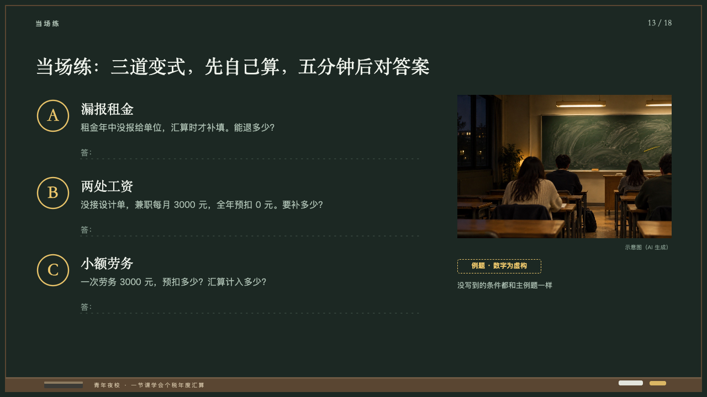
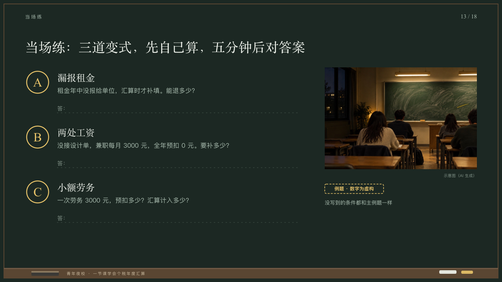

# exercises

Questions with room left to answer.

Code: [`src/layouts/compositions/exercises.tsx`](../../../src/layouts/compositions/exercises.tsx). The header comment there is the contract. The chalkboard setting only.

## lecture, annual tax reconciliation evening class sample, 2026-10

Settled on p13. The round's decisions are in [2026-10-08-lecture](../../rounds/2026-10-08-lecture/README.md).

| board (p13) | engine |
| :-: | :-: |
|  |  |

**What it looks like.** Two to four questions from y180 every 140px: a letter at 32px in the serif in yellow in a ring of yellow 28px in radius at x96, the name at 24/34 in the serif from x146 and the question at 16/26 in the grey under it, then a dotted line on y+108 to x760 beginning 「答：」 (「Answer:」). At the right a photograph 388 by 260 with its caption, the stamp under it and, under the stamp, the page's footnote as a note at 13/22 in the grey.

**Why.** Practice on the spot: the questions on the board and a line each to write the answer on.

**What it gave up.**

- Takes an `image` and a `row_cards` of two to four items, either order, each a name and a text that holds a question mark. The page's footnote stands under the stamp as a note rather than a source at the foot, as the board placed it.
