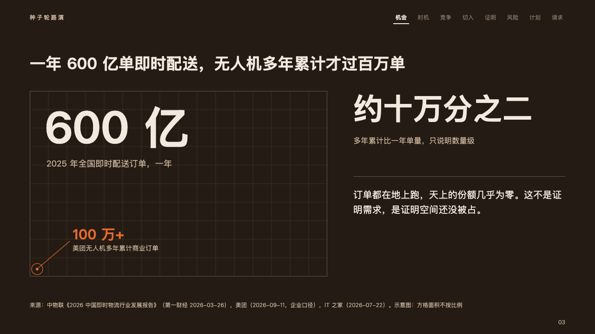

# expanse

How small one thing is beside another: the whole set huge over a field of squares, the part a dot of the fire in its corner.

Code: [`src/layouts/compositions/expanse.tsx`](../../../src/layouts/compositions/expanse.tsx). The header comment there is the contract. The pitch setting only.

## ember, low-altitude delivery pitch sample, 2026-10

Settled on the scale page (p03). The round's decisions are in [rounds/2026-10-06-ember](../../rounds/2026-10-06-ember/README.md).

| board (p03) | engine |
| :-: | :-: |
|  |  |

**What it looks like.** At the left a field of 40px squares, 640 by 400, in a hairline frame, its grid in the stage's dark band. The whole set over it at 96px bold (80px when it is wider), 「600 亿」 ("60bn"), and what it counts under it at 18px in the warm grey. In the field's lower corner a 3px dot of the fire in a 12px ring, a leader up from it to the part's figure at 30px in the fire (「100 万+」) and its label at 14px. At the right, from x760, the ratio at 64/76 bold (「约十万分之二」, "About 2 in 100,000"), what it measures at 16px in the warm grey, a hairline, and the page's point at 20/32 in the ivory. Every word over the grid stands on a plate of the stage's colour, 4px wider than its ink all round.

**Why.** A pitch's first number lands when the room sees the gap, not when it compares two figures. The field makes the whole feel large and the dot makes the part feel small, so the ratio beside them needs no chart.

**What it gave up.**

- A `kpi_cards` of three items, the whole, the part with its figure written `**…**`, then the ratio, each with a label and nothing else, then optionally a `paragraph`.
- The squares are not to scale. The sample's source line says so (「示意图：方格面积不按比例」).
- A whole wider than the field at 80px, a ratio past two lines, a label past one line (the ratio's past two) or a point past four lines sends the page back.
- The board ran the grid under the words. The engine knocks each word out of it.
