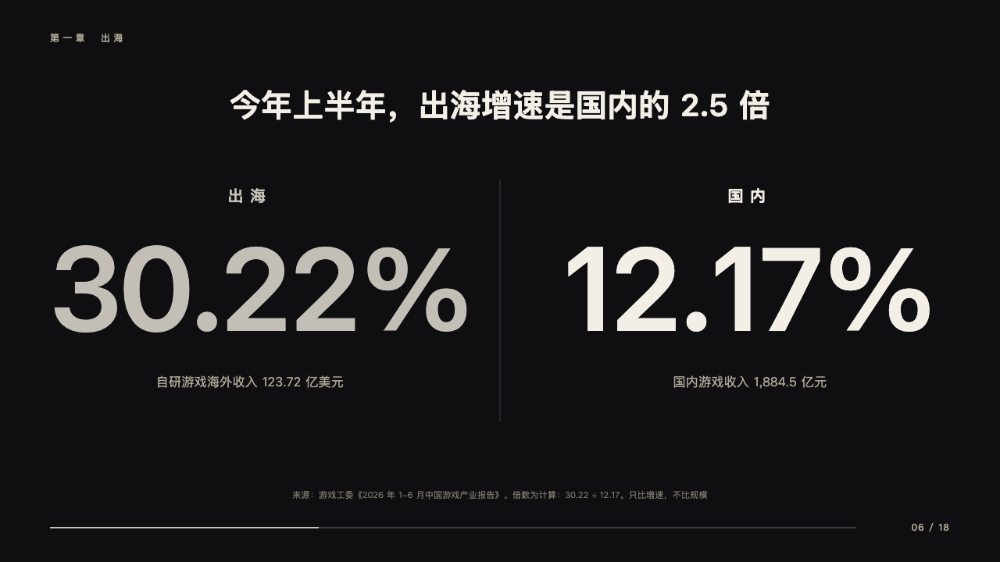
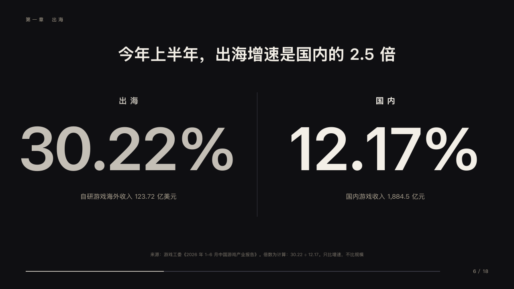

# faceoff

Two figures face to face.

Code: [`src/layouts/compositions/faceoff.tsx`](../../../src/layouts/compositions/faceoff.tsx). The header comment there is the contract. The keynote setting only.

## stage, game developers keynote sample, 2026-10

Settled on p06. The round's decisions are in [2026-10-08-stage](../../rounds/2026-10-08-stage/README.md).

| board (p06) | engine |
| :-: | :-: |
|  |  |

**What it looks like.** The claim bold at 40/50 centred from y110. A hairline down the middle from y230 to y540. On each side a name at 20px tracked 8px from y236, a figure bold at 150px closed up 4px from y280 and what was counted at 16/26 in the sand from y476. The figure the author marks whole (`**30.22%**`) and its name are silver.

**Why.** Two rates the room should compare at a glance, and only compare.

**What it gave up.**

- Takes a `kpi_cards` of two. A figure too wide for its half gives up to a fifth of its size, and both figures share the size.
