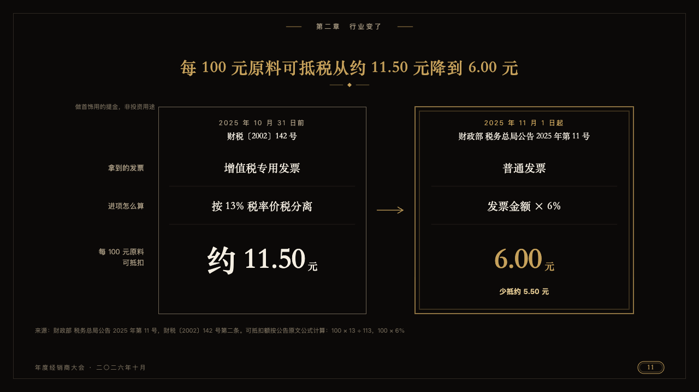
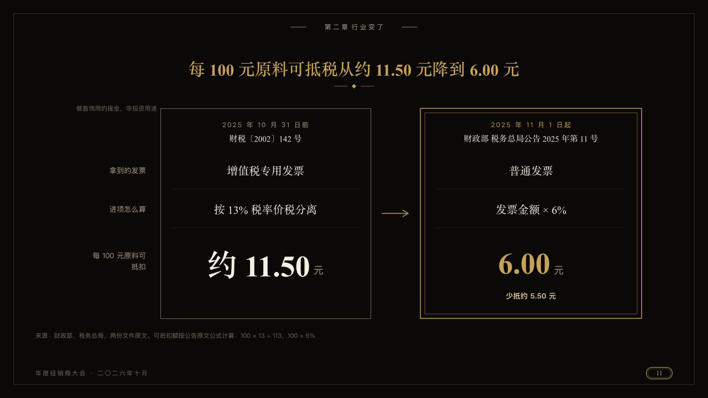

# facing

One rule before and after a change, as two invitation cards side by side.

Code: [`src/layouts/compositions/facing.tsx`](../../../src/layouts/compositions/facing.tsx). The header comment there is the contract. The invitation setting only.

## luxe, gold dealer conference sample, 2026-10

Settled on p11. The round's decisions are in [2026-10-08-luxe](../../rounds/2026-10-08-luxe/README.md).

| board (p11) | engine |
| :-: | :-: |
|  |  |

**What it looks like.** The earlier state is a card outlined in the dim gold, the later one a gilt card, a gold arrow between them. Each card opens with when it held, small and tracked, and what it is in the serif. Then a line for each measure centred in the serif with a hairline under it, the measures named at the left. The measure the page is about (the last, marked) is set large: the earlier value in ivory, the later in gold, and the move under the gilt card.

**Why.** A tax rule is a document. Setting each version as a card keeps the comparison formal and the new rule in the place of honour.

**What it gave up.**

- Takes one `from_to` of three measures, the last marked, with no icons, tags or span.
- A mark on another measure, or a value or heading past its room, sends the page back.
