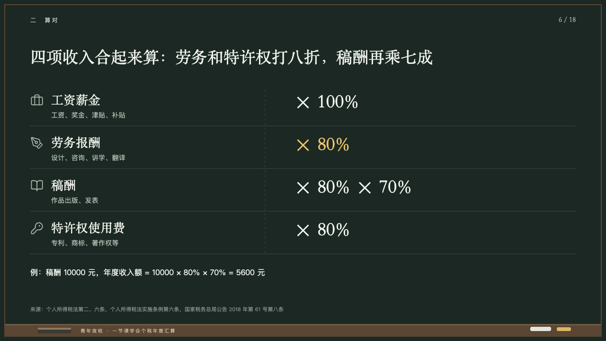
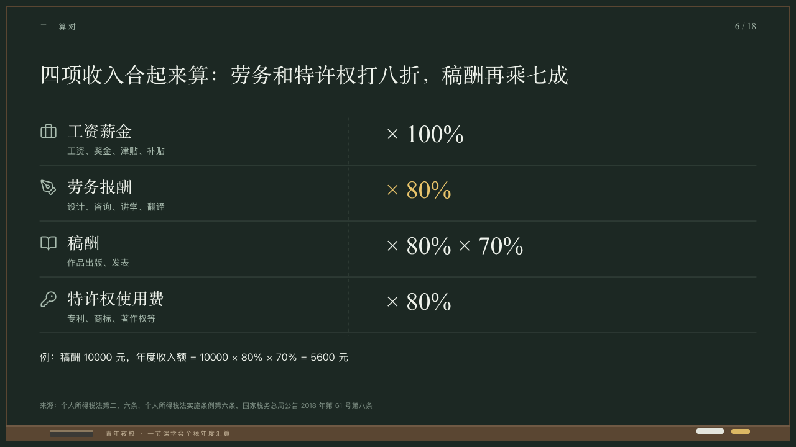

# factors

Things beside the factor each is multiplied by.

Code: [`src/layouts/compositions/factors.tsx`](../../../src/layouts/compositions/factors.tsx). The header comment there is the contract. The chalkboard setting only.

## lecture, annual tax reconciliation evening class sample, 2026-10

Settled on p06. The round's decisions are in [2026-10-08-lecture](../../rounds/2026-10-08-lecture/README.md).

| board (p06) | engine |
| :-: | :-: |
|  |  |

**What it looks like.** Rows from y190 every 90px under hairlines: a symbol at 28px in the grey, the name at 26/40 in the serif and what it covers at 14/22 in the grey under it, and across a dashed line at x560 the factor at 40/54 in the serif from x620. The marked row's factor is yellow. A worked line at 16/30 in chalk white under the rows.

**Why.** Four incomes, each counted at its own share, read across like a times table.

**What it gave up.**

- Takes a `row_cards` of three to five items, each an icon, a name, a text and a `sub` written after a multiplication sign (「× 80%」), at most one `highlight`, and optionally a `paragraph`.
