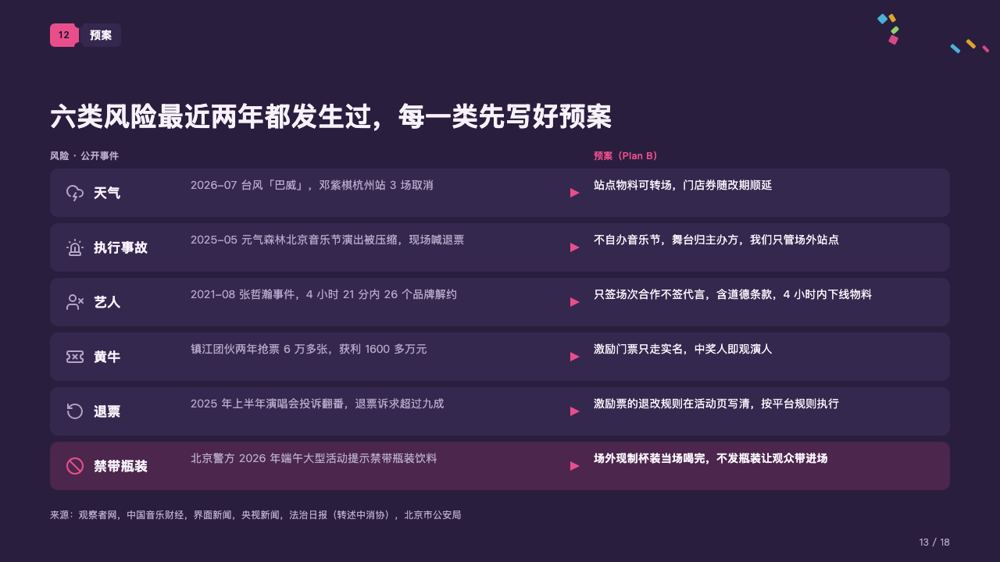
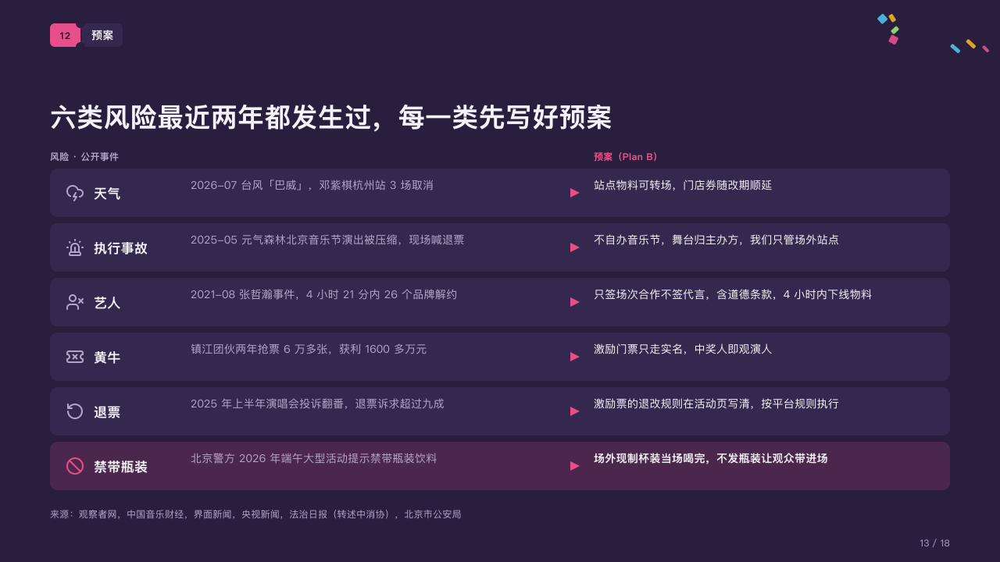

# fallbacks

A plan B for every risk, each risk a public case.

Code: [`src/layouts/compositions/fallbacks.tsx`](../../../src/layouts/compositions/fallbacks.tsx). The header comment there is the contract. The marquee setting only.

## rally, summer concert season proposal sample, 2026-10

Settled on the plan B page (p13). The round's decisions are in [rounds/2026-10-06-rally](../../rounds/2026-10-06-rally/README.md).

| board (p13) | engine |
| :-: | :-: |
|  |  |

**What it looks like.** Two small headers over a stack of bars, one a risk: its icon, the risk's name bold, what happened in grey, an arrow of the magenta, and the plan B in the light. The header over the plans is in the magenta. The row the page leads with (`emphasis: "highlight"`) sits on a tint of the magenta, its icon in the magenta and its plan bold.

**Why.** Every risk on the page has happened to someone in the last two years. Setting the public case beside the response shows the plan B is written before it is needed.

**What it gave up.**

- A cell of the first column is written "risk：what happened" (「天气：2026-07 台风…」). The colon is declared on the name's line, not printed.
- A `data_table` of two columns, none marked or with an icon, and two to six rows each with an icon, at most one highlighted and none a total or tagged; no title or source.
- A name past its column, what happened or a plan past two lines, or a header past its half sends the page back.
