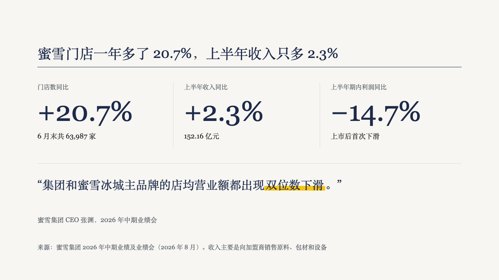
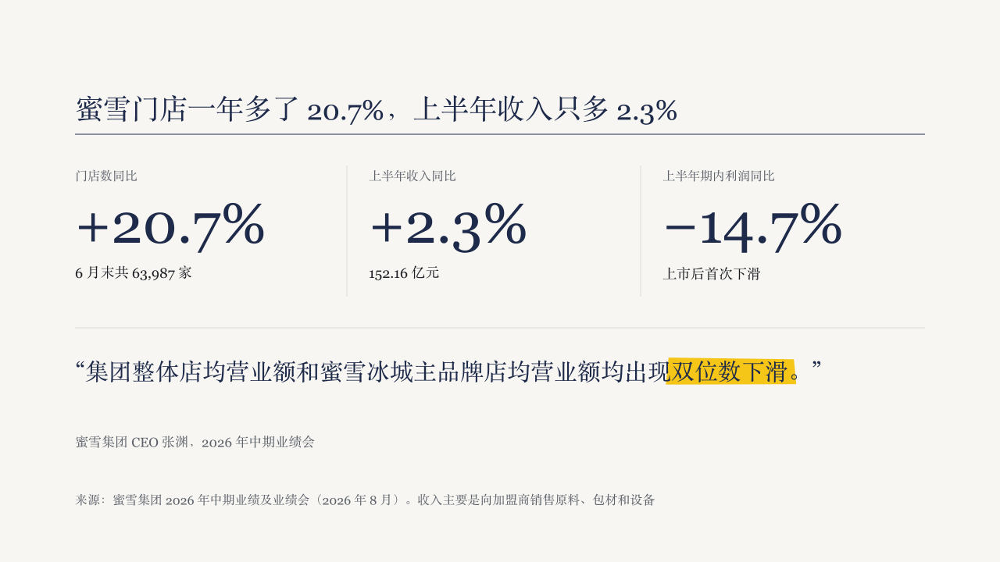

# figures

Two to four headline figures set open in a row, with a quote set large under them or the page's closing line in a primary block.

Code: [`src/layouts/compositions/figures.tsx`](../../../src/layouts/compositions/figures.tsx). The header comment there is the contract.

## brief, tea sample, 2026-10

| board (p05) | engine |
| :-: | :-: |
|  |  |

**What it looks like.** Columns 376px apart on the type area, hairlines between them. Each column a 16px muted label, the figure at 72px regular in primary, and a note at 18px in body ink. A rule across the page 40px under the columns, then the quote at 30/46 in primary within two lines, its marked run on the theme's emphasis stroke, and the speaker at 17px muted under room for two quote lines.

**Why.** A page that says "stores up, revenue flat, profit down" is three numbers and one sentence from the person who has to answer for them. Cards and arrows would make the numbers smaller and say less. The rule under the row separates what was measured from what was said about it.

**What it gave up.**

- The figures are the author's `kpi_cards`: a value, a label and a `note` each. An item with a delta arrow, an icon or a source line has no place here, and the page goes to the ordinary cards.
- Every figure shares one size. When one does not fit its column at 72px they all step down to 56px together, and below that the page goes back to the face.
- The quote's words are set between quotation marks the composition adds, unless the author already wrote them.
- A callout after the figures closes the page in a primary block at 24px, the size the tea board gives the timeline's.
