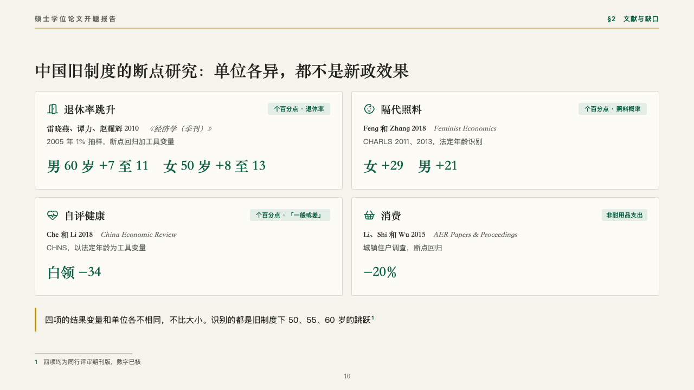
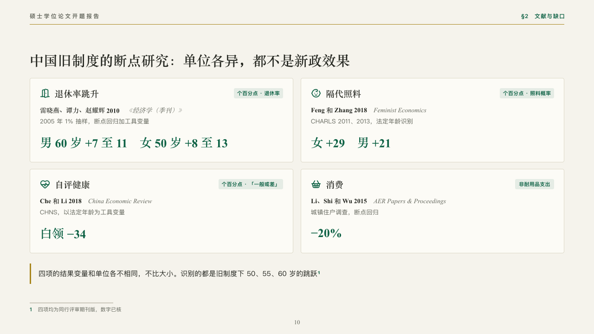

# findings

Studies side by side, each in its own unit.

Code: [`src/layouts/compositions/findings.tsx`](../../../src/layouts/compositions/findings.tsx). The header comment there is the contract. The manuscript setting only.

## thesis, retirement age thesis proposal sample, 2026-10

Settled on the Chinese studies (p10). The round's decisions are in [rounds/2026-10-06-thesis](../../rounds/2026-10-06-thesis/README.md).

| board (p10) | engine |
| :-: | :-: |
|  |  |

**What it looks like.** A card a study in two columns: its icon in emerald, what it measures in the heading serif, the unit its result is in as a chip of pale emerald at the top right, its authors bold in the heading serif with the journal after them in italics, its data and method in the grey, and its result set large in emerald. The cards are not numbered or ranked. A closing line with a gold bar.

**Why.** The four studies measure retirement, care, health and spending in different units. Unranked cards with the unit on each keep the reader from comparing what cannot be compared.

**What it gave up.**

- Takes a `kpi_cards` of two to four, each with an icon, a label, a tag (the unit), a source written 「authors · journal」, a note and a value, then optionally a `callout`.
- A line past its card's width or a closing line past one line sends the page back.
