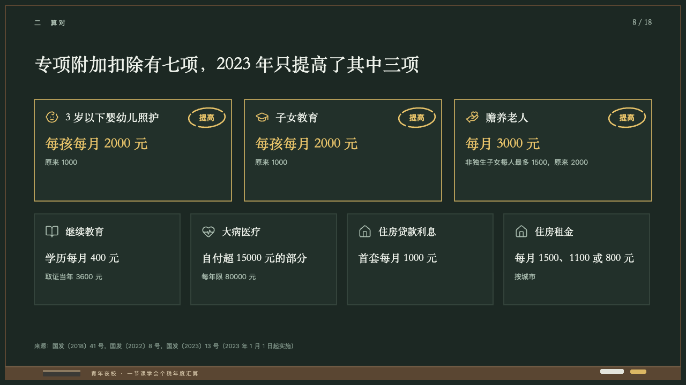
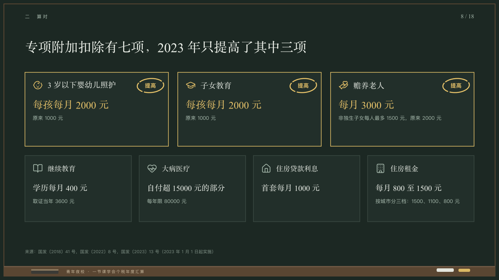

# flashcards

Cards to learn, the ones that changed ringed.

Code: [`src/layouts/compositions/flashcards.tsx`](../../../src/layouts/compositions/flashcards.tsx). The header comment there is the contract. The chalkboard setting only.

## lecture, annual tax reconciliation evening class sample, 2026-10

Settled on p08. The round's decisions are in [2026-10-08-lecture](../../rounds/2026-10-08-lecture/README.md).

| board (p08) | engine |
| :-: | :-: |
|  |  |

**What it looks like.** Two rows of cards on the board: two to four 190px tall from y186, 24px apart, and two to five 170px tall from y400, 20px apart. Each card a box of the board with a hairline edge, its symbol at 26px and its name in the serif (20px on top, 18px under), the amount in the serif (26px on top, 20px under) and up to two lines at 13/22 in the grey. A card the author tags has a yellow edge, its symbol and amount in yellow, and the tag at 14px bold in yellow inside a ring of yellow chalk at its top right.

**Why.** Seven deductions to remember, and the three that went up circled the way a teacher circles them.

**What it gave up.**

- Takes two `icon_cards`, the first of two to four items for the top row and the second of two to five, each an icon, a name and a text whose first line is the amount. A card's tag is its ring. `icon_cards` keeps its six-item limit: seven cards are two components.
