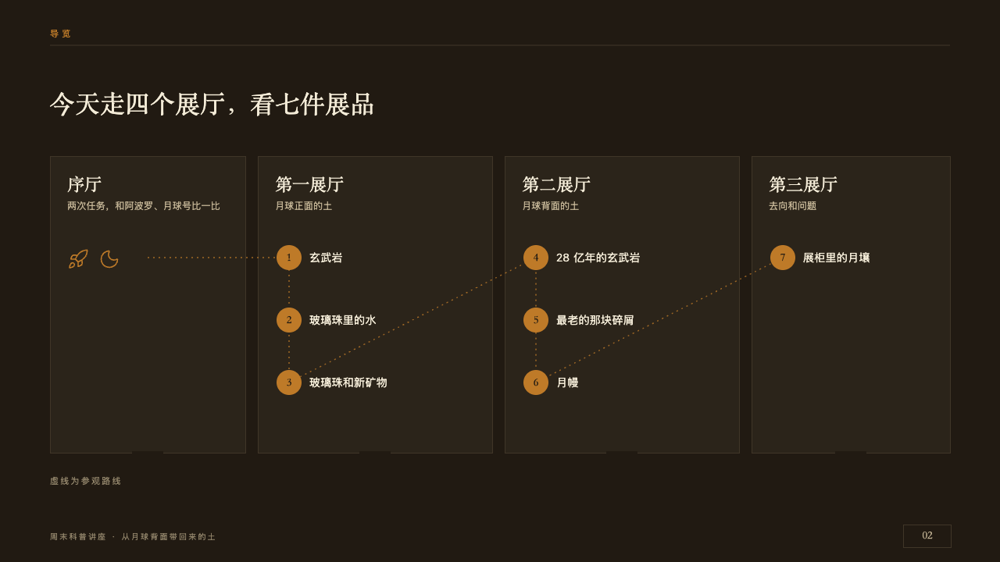

# floorplan

The visit drawn as a gallery's floor plan.

Code: [`src/layouts/compositions/floorplan.tsx`](../../../src/layouts/compositions/floorplan.tsx). The header comment there is the contract. The placard setting only.

## museum, Moon soil science talk sample, 2026-10

Settled on p02. The round's decisions are in [2026-10-08-museum](../../rounds/2026-10-08-museum/README.md).

| board (p02) | engine |
| :-: | :-: |
|  |  |

**What it looks like.** The claim over the page. The rooms side by side from y200, 380px tall, each a board with a seam round it and a 40px doorway left open in the middle of its lower wall: its name at 22/30 in the serif, what it holds at 12/20 in old paper, then its exhibits one under another 80px apart, each a copper disc 32px across with its number bold in the serif in the dark of the hall and its name at 14/22 beside it. The exhibits are numbered across the whole visit. A dotted copper walk runs from the first room's middle through every exhibit in order. A room with no exhibits shows its symbol where they would stand. The source stands under the plan on y606.

**Why.** A talk that walks through halls should show the halls before it enters them, with the route and how many exhibits each holds.

**What it gave up.**

- Takes a `roadmap`: each room a phase, what it holds its `period`, its exhibits its `points`, up to three a room. A roadmap with rows, durations, checkpoints or a marked phase is not a floor plan and goes elsewhere.
- A room of two exhibits or more is 300px wide and the others share the rest, where the board drew 250, 300, 300 and 254.
- A room with no exhibits shows its one `icon`. The board drew a rocket and a moon.
- A name or a line past what its room holds sends the page back.
