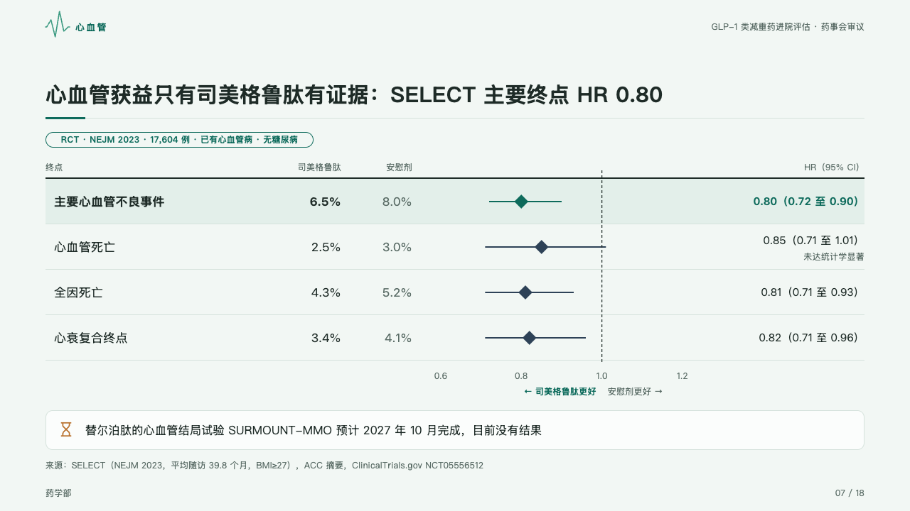

# forest

An outcome trial's endpoints as a table with its forest plot, the ratio as the author wrote it at the right.

Code: [`src/layouts/compositions/forest.tsx`](../../../src/layouts/compositions/forest.tsx). The header comment there is the contract. The dossier setting only.

## clinic, GLP-1 formulary review sample, 2026-10

Settled on the cardiovascular page (p07), under the page's tag. The round's decisions are in [rounds/2026-10-05-clinic](../../rounds/2026-10-05-clinic/README.md).

| board (p07) | engine |
| :-: | :-: |
|  |  |

**What it looks like.** An open table under a 2px rule of ink, 64px a row: the endpoint, the rate in each arm, and at the right the hazard ratio with its interval as the author wrote it (「0.80（0.72 至 0.90）」). Between them the plot: the ratio as a diamond on its interval's 2px line, a dashed line up the page at 1, its ticks under it, and either side of 1 which arm a ratio there favours, in the arms' own names. The endpoint the page is about (`emphasis: "highlight"`) sits on the mark's tint with its words bold and its diamond in the mark, the others in slate. A note after the ratio (「，未达统计学显著」) sets on a second line in 12px muted type. A trial still to report stands under the table in a card with its icon.

**Why.** A committee reads a hazard ratio with its interval and where it falls against 1, and a primary endpoint before the secondary ones.

**What it gave up.**

- A `data_table` of four columns and two to six rows whose last column reads as a ratio, then optionally a `callout` with an icon.
- A ratio cell it cannot read, a table with a title, tags, icons or a total row, or rows taller than the band send the page back.
