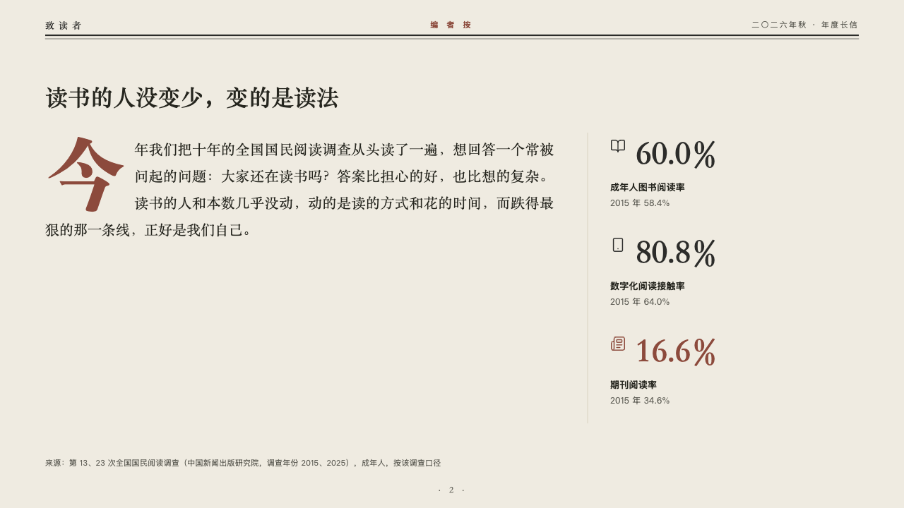
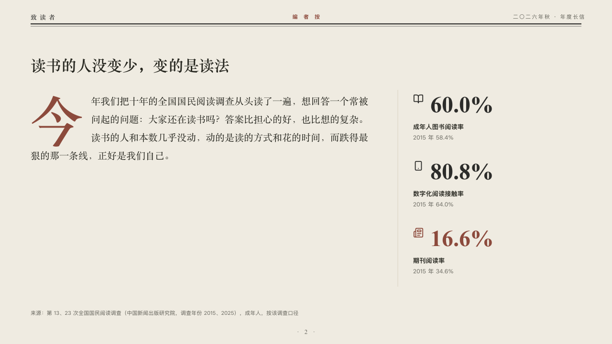

# foreword

An editor's note with a drop cap, beside a column of figures.

Code: [`src/layouts/compositions/foreword.tsx`](../../../src/layouts/compositions/foreword.tsx). The header comment there is the contract. The periodical setting only.

## journal, annual letter to readers sample, 2026-10

Settled on p02. The round's decisions are in [2026-10-07-journal](../../rounds/2026-10-07-journal/README.md).

| board (p02) | engine |
| :-: | :-: |
|  |  |

**What it looks like.** The claim over the page. Under it the note in the heading serif at 20/38, its first character dropped three lines deep in brick red, the lines beside it set short and the rest at the full measure. At the right, past a hairline, two or three figures in a column: each its symbol, the figure at 40px in the heading serif, its label bold and the line that puts it in context in the grey. The marked figure (`**…**`) and its symbol are in brick red.

**Why.** A letter opens with its editor speaking before any chart. The note says what the issue found, and the column holds the three figures it found.

**What it gave up.**

- Takes a `paragraph` with no marked runs, then a `kpi_cards` of two or three, each with a symbol and a note.
- A note past ten lines, a figure with a tag, a source or a direction, or a figure, label or note past its column sends the page back.
- No marked runs in the note: the drop cap measures its three short lines as plain text.
