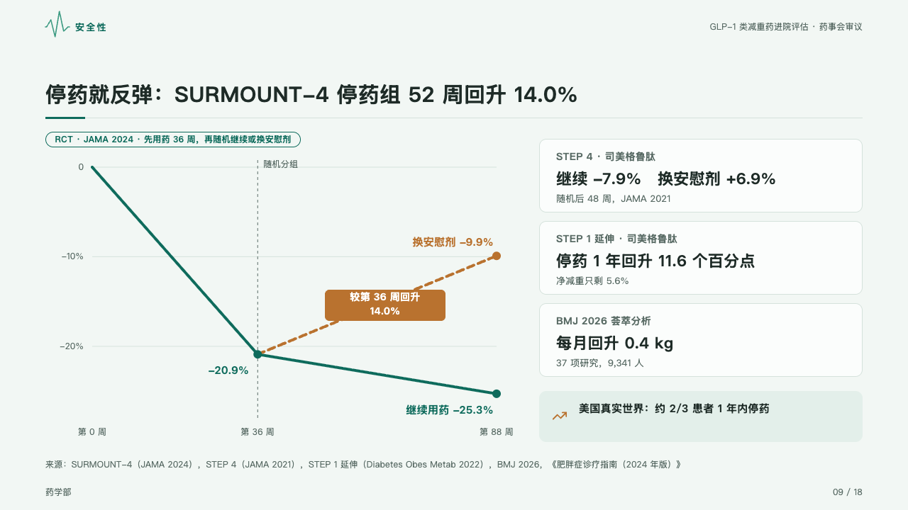
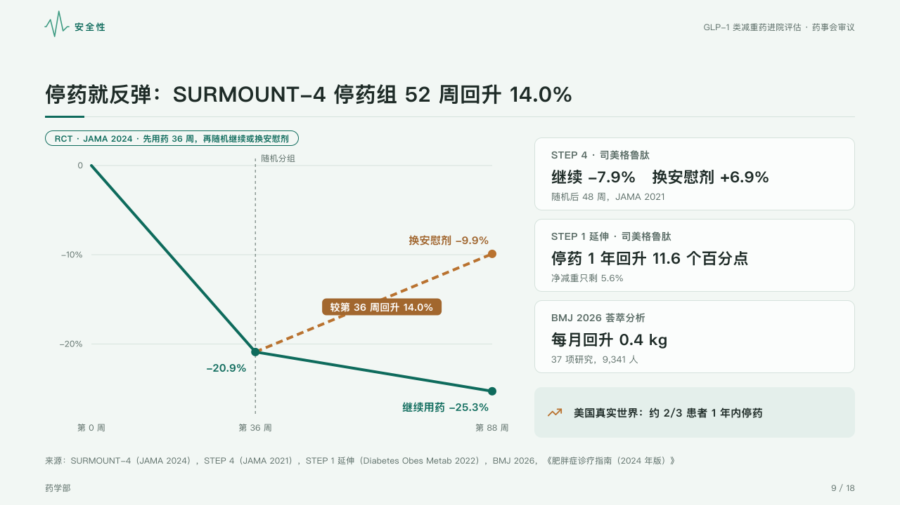

# fork

Two groups that walk one road and part: the line the page is about goes on in the mark, the other turns off dashed, with the evidence that says the same beside it.

Code: [`src/layouts/compositions/fork.tsx`](../../../src/layouts/compositions/fork.tsx). The header comment there is the contract. The dossier setting only.

## clinic, GLP-1 formulary review sample, 2026-10

Settled on the rebound page (p09), under the page's tag. The round's decisions are in [rounds/2026-10-05-clinic](../../rounds/2026-10-05-clinic/README.md).

| board (p09) | engine |
| :-: | :-: |
|  |  |

**What it looks like.** One 4px line in the mark from the start to the split, a dashed line up the plot at the split with its name (「随机分组」, from a category written 「第 36 周 · 随机分组」) 6px over the top rule. From there the marked series goes on solid in the mark and the other turns off dashed in its tone's ink (`tone: "warning"`), each end with its dot, name and figure, and a note the author pins to the branch (a callout with no icon right after the chart) stands on it in a block of that ink. Beside the plot the evidence as cards, each its source over its figure over its note, and under them a callout with its icon on the mark's tint.

**Why.** Regain is a story of one group that stopped and one that did not, told from the same starting point.

**What it gave up.**

- A `line` chart of two series over three to six categories that agree at first and then part, one marked, then optional callouts and a `kpi_cards` of two or three items.
- Series that never part or meet again, a chart with a tag, changes or bands, or a note past its block send the page back.
