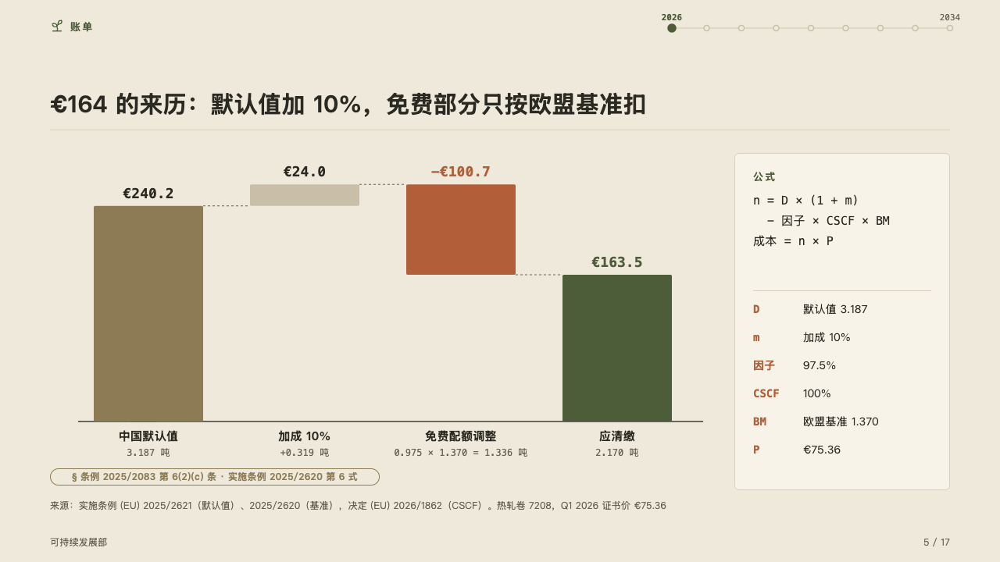
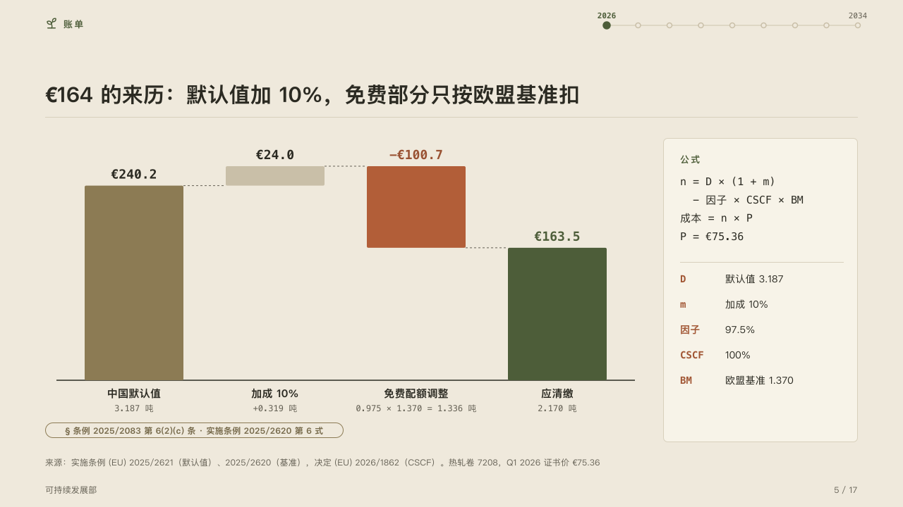

# formula

Where a figure comes from, step by step, beside the formula that makes it.

Code: [`src/layouts/compositions/formula.tsx`](../../../src/layouts/compositions/formula.tsx). The header comment there is the contract. The yearbook setting only.

## almanac, CBAM sample, 2026-10

Settled on the bridge page (p05). The round's decisions are in [rounds/2026-10-05-almanac](../../rounds/2026-10-05-almanac/README.md).

| board (p05) | engine |
| :-: | :-: |
|  |  |

**What it looks like.** A waterfall with no value axis: the opening total in the quiet ink, a step up in the ghost, the step the page is about (`emphasis`) in the accent, the closing total in the mark, each value in mono over its bar and dashed lines carrying each level on to the next bar. Under each bar its label bold and its note in mono (`items[].note`). Beside it a card: the formula's name (the `code` block's `title`) tracked in the mark, its lines in mono with their indents kept, a hairline, then each parameter's symbol in mono in the accent and what it stands for. Under the bridge the page's `tag`, the provision the formula is written in.

**Why.** A board trusts a charge it can work out again. Each step of the sum is a bar, and the card names every number the steps are made of.

**What it gave up.**

- A `waterfall` of three to six bars, every level zero or more, with no `emphasis_label`. A `code` of one to five lines. A `bullets` of one to eight items written "symbol: what it stands for".
- A level below zero, a label or a note past its column, a formula line or a parameter past the card, or anything taller than the band sends the page back.
