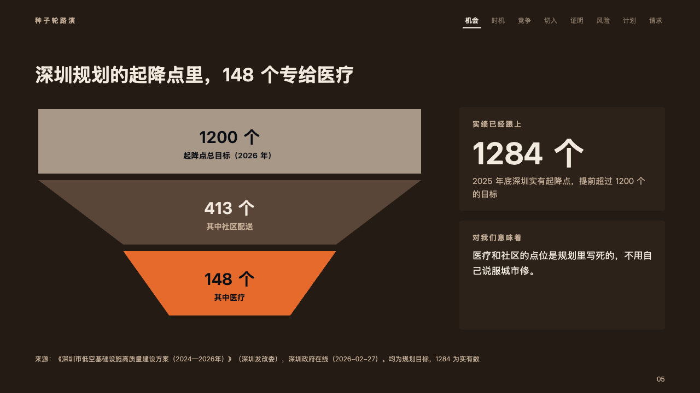
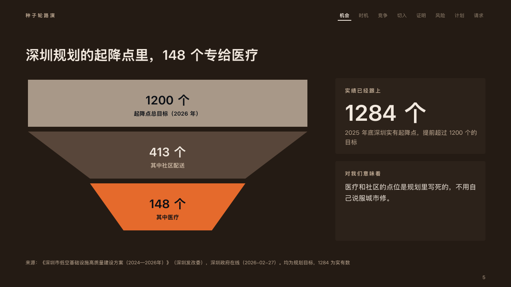

# funnel

A plan narrowed to the part a pitch is about: levels stacked as trapezoids, the last one in the fire.

Code: [`src/layouts/compositions/funnel.tsx`](../../../src/layouts/compositions/funnel.tsx). The header comment there is the contract. The pitch setting only.

## ember, low-altitude delivery pitch sample, 2026-10

Settled on the landing points page (p05). The round's decisions are in [rounds/2026-10-06-ember](../../rounds/2026-10-06-ember/README.md).

| board (p05) | engine |
| :-: | :-: |
|  |  |

**What it looks like.** Two to four levels down the left 700px, each as wide as its value to the 0.55th power, so the smallest still holds its words. The widest is a plain block in the palette's quietest ink, the levels between in the darker band, and the last, the part the page is about, in the fire. Each level names its value bold at 30px with the chart's unit (「1200 个」, "1,200 points") and what it counts under it at 14px, in the dark ink on the light and fire levels and in the ivory on the dark. At the right, from x840, a card with what has already happened (its label small and tracked, its figure at 56px, a note) and under it a card with what it means for the founder at 17/28.

**Why.** The page's point is the narrowing, from a city's whole plan to the slice that is the startup's. The fire at the foot of the funnel is where the eye ends.

**What it gave up.**

- A `chart` of `chart_type: "funnel"` with one series of two to four levels that never widen, then optionally a `kpi_cards` of one item with no delta, tone, icon, source or tag, then optionally a `callout` with a title and no tag or icon.
- Widths follow the value to the 0.55th power, not the value: a level an eighth of the top would not hold its words.
- A value or name wider than its level, a card's label past one line, its figure wider than the card, its note past two lines, or the callout's text past four lines sends the page back.
