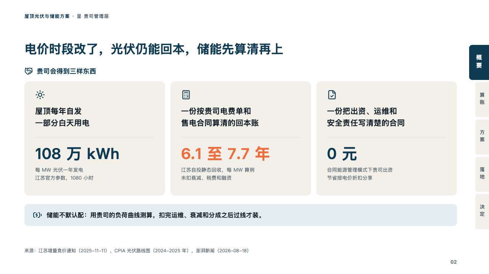

# gains

What a client gets from a proposal, a card a thing with its figure.

Code: [`src/layouts/compositions/gains.tsx`](../../../src/layouts/compositions/gains.tsx). The header comment there is the contract. The binder setting only.

## proposal, rooftop solar and storage proposal sample, 2026-10

Settled on the page of what the client gets (p02). The round's decisions are in [rounds/2026-10-06-proposal](../../rounds/2026-10-06-proposal/README.md).

| board (p02) | engine |
| :-: | :-: |
|  |  |

**What it looks like.** A line naming the offer with its icon (the page's `verdict_banner`, 「贵司会得到三样东西」), then a card of sand a thing the client gets: its icon in petrol, what it is in two lines of 20px bold, a hairline, its figure at 40px in petrol and a note in two lines of grey. The figure the page lands on (written `**…**`, 「6.1 至 7.7 年」) is in the brick red. Under the cards, a bar of the pale petrol with the note's icon and one line.

**Why.** A client's management turns to a proposal for what they get. Three things, each with the figure that proves it, answer that before any sum is worked.

**What it gave up.**

- Takes optionally a `verdict_banner`, a `kpi_cards` of two to four with an icon each and no unit, delta, tag, tone or source, at most one value marked whole, then optionally a `callout` with no title or tag.
- A figure wider than its card, a label or a note past two lines, or a banner or bar past one line sends the page back.
- The board's tangerine figure is brick red, which reads at 4.82 on the sand as it is (the round's decision 15). The tangerine read at 2.66 there and had to be moved toward the ink.
