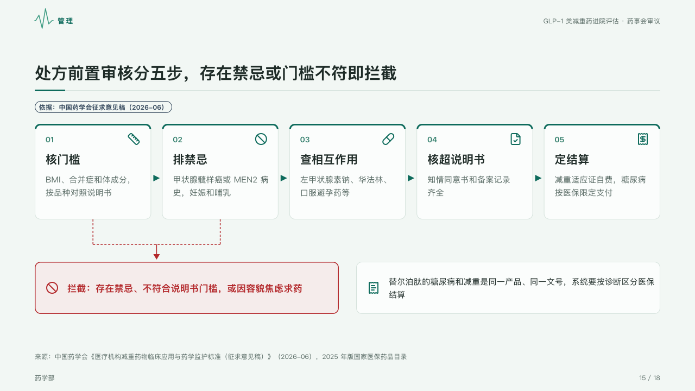

# gate

A check run in steps, where some steps can stop it: the steps as cards with arrows between them, dashed lines from the stopping steps into a stop box.

Code: [`src/layouts/compositions/gate.tsx`](../../../src/layouts/compositions/gate.tsx). The header comment there is the contract. The dossier setting only.

## clinic, GLP-1 formulary review sample, 2026-10

Settled on the prescription review page (p15), under the page's tag. The round's decisions are in [rounds/2026-10-05-clinic](../../rounds/2026-10-05-clinic/README.md).

| board (p15) | engine |
| :-: | :-: |
|  |  |

**What it looks like.** The steps as cards 176px tall in a row, each with its number in the accent, its icon in the mark at the top right, its title bold at 21px, its text muted at 15px, a 3px top edge of the mark, small arrowheads between them. A step that can stop the process (`tone: "danger"`) sends a dashed line down in the danger ink; the lines join and run into the stop box, the warning callout set in the danger ink on its pale tint with its icon. Beside it an informational callout stands as a plain card with its icon.

**Why.** A review that can refuse a prescription has to show where the refusal comes from.

**What it gave up.**

- A `steps` of two to five items, then up to one `warn` callout and one `info` or `tip` callout.
- Stopping steps with no box to stop in, a title past one line or text past three lines send the page back.
