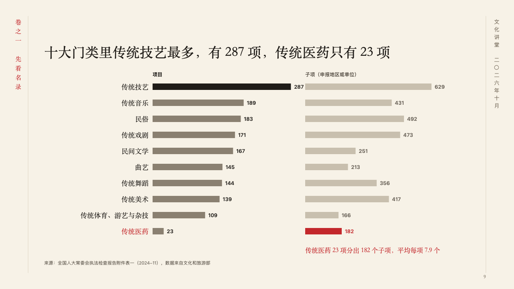
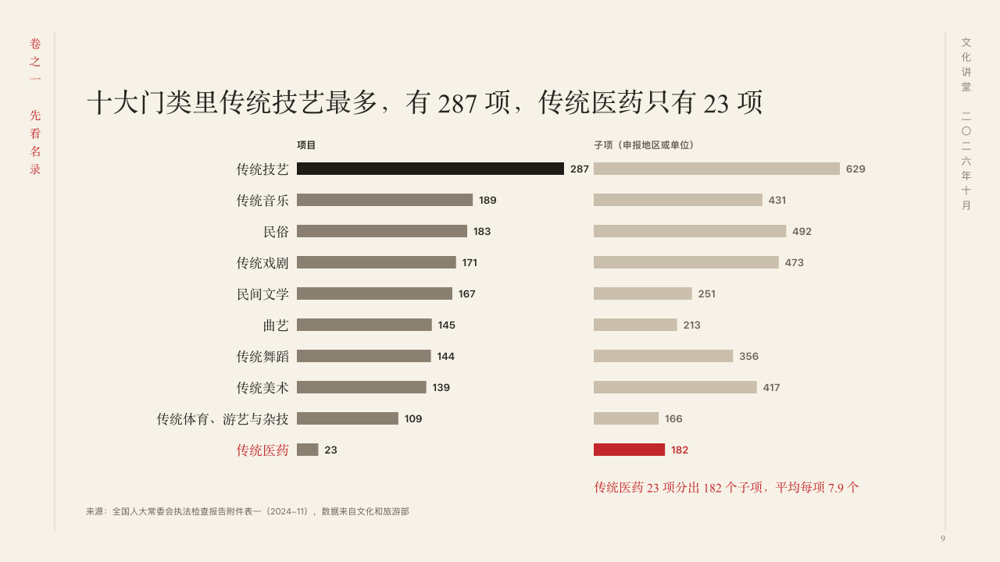

# genres

Two counts of the same categories side by side, each on its own scale.

Code: [`src/layouts/compositions/genres.tsx`](../../../src/layouts/compositions/genres.tsx). The header comment there is the contract. The scroll setting only.

## ink, intangible heritage public lecture sample, 2026-10

Settled on p09. The round's decisions are in [2026-10-07-ink](../../rounds/2026-10-07-ink/README.md).

| board (p09) | engine |
| :-: | :-: |
|  |  |

**What it looks like.** The claim over the page. Under it a row a category, its name in the heading face set flush right, and two bars, each series on its own scale under its own name: the first in the taupe with its largest bar in burnt ink, the second fainter. The point the author marks (`emphasis`) is in cinnabar, its bar, its figure and the row's name, and the line that says what it means (a plain `callout`) stands under the second column in cinnabar.

**Why.** Items and their sub-items count different things, so each keeps its own scale. Side by side they show where a few items carry many entries.

**What it gave up.**

- Takes an untitled bar chart on its side of two series over three to ten categories at zero or above, then optionally a `callout` with words alone.
- A chart with a tag, ranges, gaps, changes, bands, a reference, notes, symbols, statuses or a series' emphasis, series that do not cover the same categories, or a name, figure or line past its room sends the page back.
