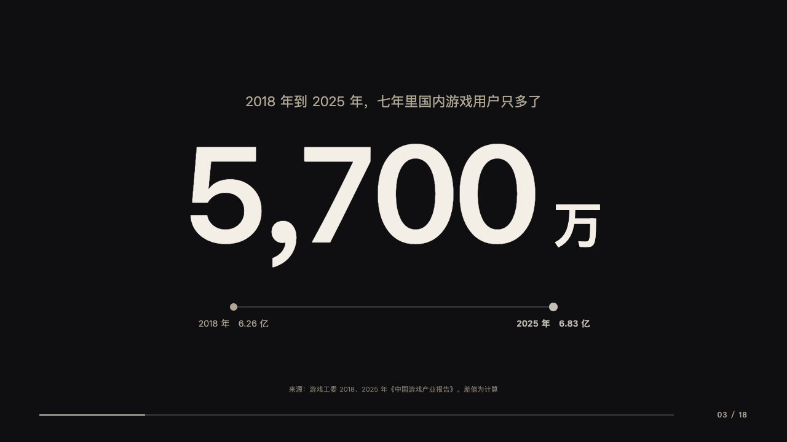
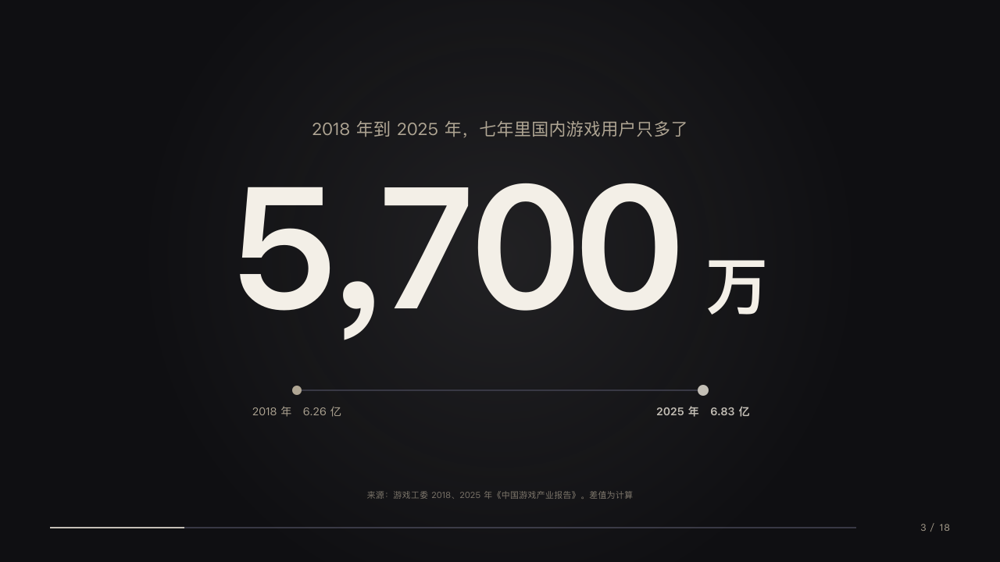
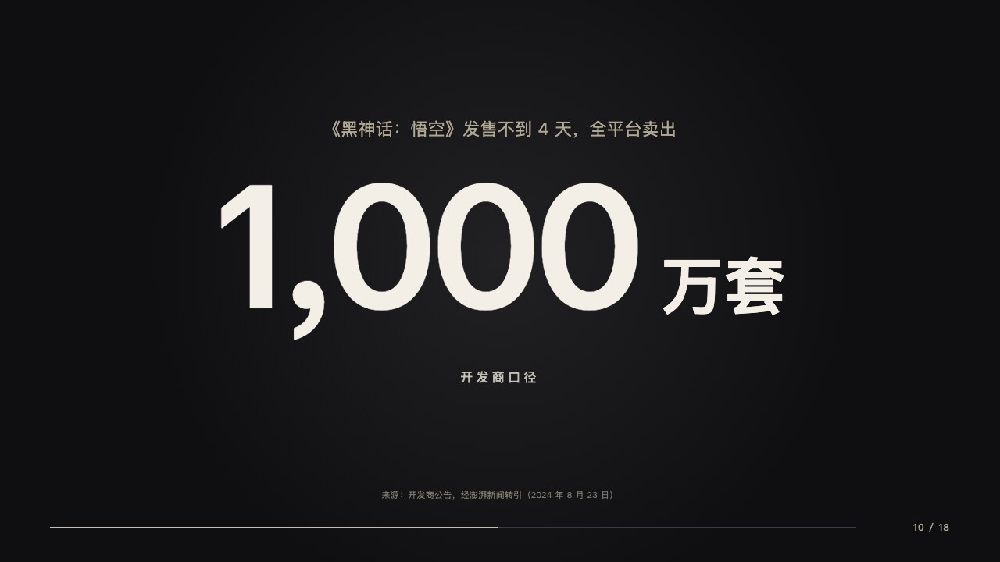
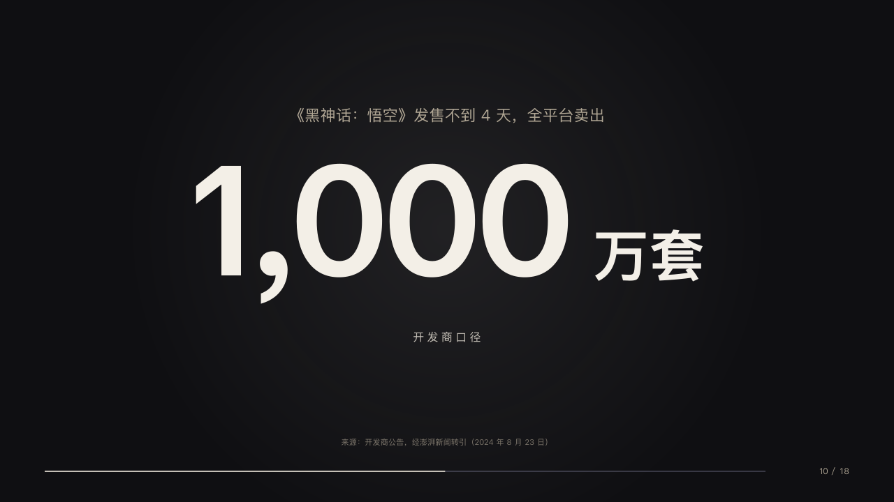

# giant

One figure under the line that leads into it.

Code: [`src/layouts/compositions/giant.tsx`](../../../src/layouts/compositions/giant.tsx). The header comment there is the contract. The keynote setting only.

## stage, game developers keynote sample, 2026-10

Settled on p03, p10. The round's decisions are in [2026-10-08-stage](../../rounds/2026-10-08-stage/README.md).

| board (p03) | engine |
| :-: | :-: |
|  |  |

| board (p10) | engine |
| :-: | :-: |
|  |  |

**What it looks like.** A follow spot 460px in radius. The claim at 22/30 in the sand centred from y150 as the line that leads into the figure, the figure bold at 220px in the paper white closed up 6px with its unit at 80px after it, centred from y196. Under it what the figure rests on: a label written as two ends with an arrow (「2018 年　6.26 亿 → 2025 年　6.83 亿」) as a hairline from x380 to x900 on y500, a sand dot at its start, a silver dot at its end and each end's words at 14px under its dot, the later one bold in silver, or a short label tracked 4px at 16px in silver from y470 (「开发商口径」). The source centred at the foot.

**Why.** A figure carries the page when the talk turns on it, and the line above says what it is before the room reads it.

**What it gave up.**

- Takes a `kpi_cards` of one on a page with a claim, so a `fact` page in a deck project sets the lead-in, the figure and what it rests on together.
- The arrow in a two-ended label is drawn as the line. The page's start end carries `data-gloss-break="→"` so the scans read the label back whole.
- Every giant page has a follow spot. The board drew one on p10 and none on p03: the design system gives one to every page a figure carries alone.
