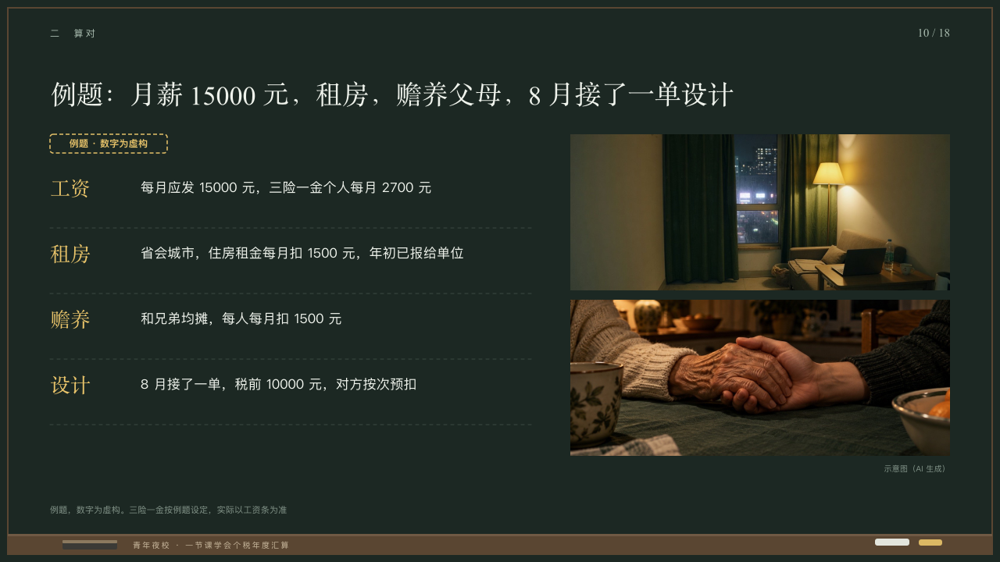

# givens

An example's givens beside its photographs.

Code: [`src/layouts/compositions/givens.tsx`](../../../src/layouts/compositions/givens.tsx). The header comment there is the contract. The chalkboard setting only.

## lecture, annual tax reconciliation evening class sample, 2026-10

Settled on p10. The round's decisions are in [2026-10-08-lecture](../../rounds/2026-10-08-lecture/README.md).

| board (p10) | engine |
| :-: | :-: |
|  |  |

**What it looks like.** The page's stamp under the title at (64, 172). The givens from y220 every 84px under dashed lines to x680: what it is at 26/40 in the serif in yellow, and the fact at 17/28 in chalk white from x180, two lines at most. At the right two photographs 486 by 200 at y172 and y384, the second's caption under it at the right.

**Why.** A worked example starts with what it gives you, written down before any sum.

**What it gave up.**

- Takes a `row_cards` of two to five items, each a name and a text, then an `image_grid` of two pictures, a caption only on the second. The stamp is the page's `stamp`.
