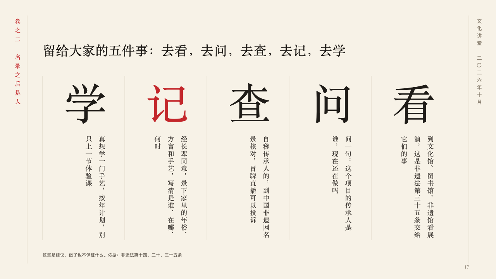
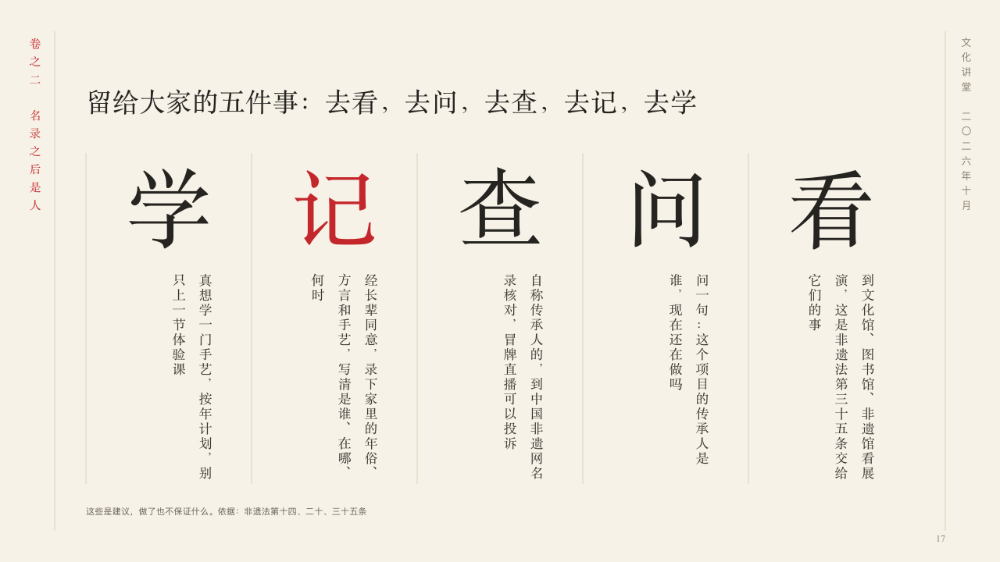

# glyphs

A few things to do, each in one word over what it means.

Code: [`src/layouts/compositions/glyphs.tsx`](../../../src/layouts/compositions/glyphs.tsx). The header comment there is the contract. The scroll setting only.

## ink, intangible heritage public lecture sample, 2026-10

Settled on p17. The round's decisions are in [2026-10-07-ink](../../rounds/2026-10-07-ink/README.md).

| board (p17) | engine |
| :-: | :-: |
|  |  |

**What it looks like.** The claim over the page. Under it a column a thing, ruled apart, each with its word set huge in the heading face and what it means under it. In Chinese the columns are read from the right, the word is one character and what it means stands upright under it, read from the right too. In a Latin deck the columns are read from the left and the words are set across them. The thing the author highlights has its word in cinnabar.

**Why.** Five things a listener can remember on the way home are five characters, and the lines under them stand upright like the rest of the scroll.

**What it gave up.**

- Takes a `row_cards` of three to six, every card with a title and words.
- A card with a symbol, a sub line or a tone, more than one highlighted card, a word of more than two characters in Chinese, or words that do not fit their column sends the page back.
