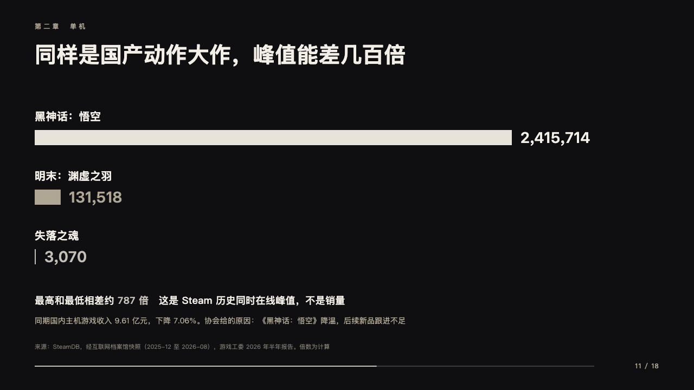
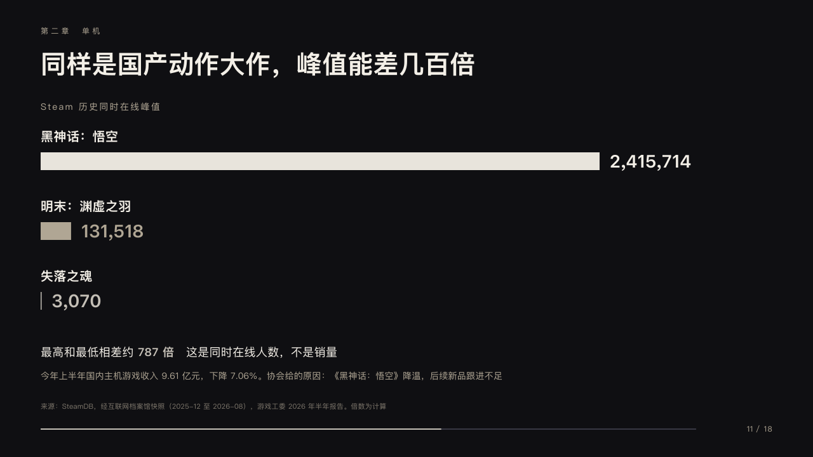

# gulf

Quantities to scale however far apart.

Code: [`src/layouts/compositions/gulf.tsx`](../../../src/layouts/compositions/gulf.tsx). The header comment there is the contract. The keynote setting only.

## stage, game developers keynote sample, 2026-10

Settled on p11. The round's decisions are in [2026-10-08-stage](../../rounds/2026-10-08-stage/README.md).

| board (p11) | engine |
| :-: | :-: |
|  |  |

**What it looks like.** What the bars count at 14px tracked 2px from y156, then two or three rows every 110px from y200: the name bold at 20px, a bar 28px thick on one scale with the largest 880px, the value bold at 28px after it. The largest bar is the paper white a breath into the dark, the marked one silver, the rest sand. A bar under 1.5px is drawn 1.5px. Under them the line that says how far apart they are at 18px, its marked words bold in silver, and one quieter line at 14px in the sand.

**Why.** The gap is the point, so the smallest is drawn even when it is barely there.

**What it gave up.**

- Takes a bar chart on its side of two or three values and one or two `paragraph`s. The series, which the board left off, is drawn small over the bars.
