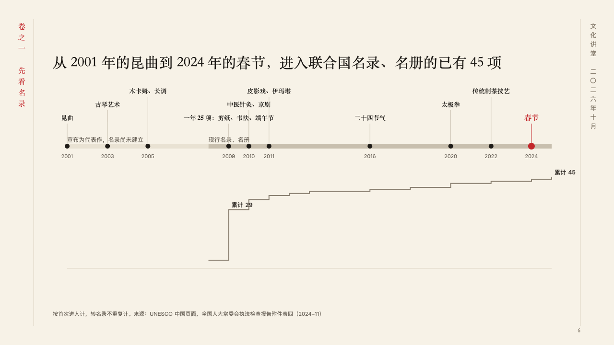
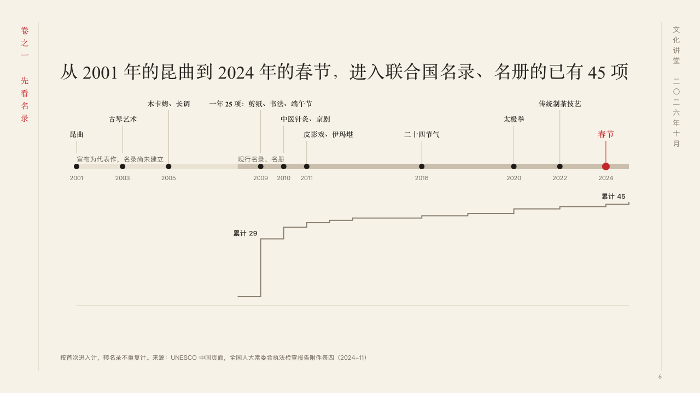

# handscroll

A long run of years unrolled to scale, with the running count under it.

Code: [`src/layouts/compositions/handscroll.tsx`](../../../src/layouts/compositions/handscroll.tsx). The header comment there is the contract. The scroll setting only.

## ink, intangible heritage public lecture sample, 2026-10

Settled on p06. The round's decisions are in [2026-10-07-ink](../../rounds/2026-10-07-ink/README.md).

| board (p06) | engine |
| :-: | :-: |
|  |  |

**What it looks like.** The claim over the page. Under it one axis of years drawn to their true distances: the spans it is divided into as bands along it, each named at its start (the timeline's `periods`), a dot a milestone with its year under it, and the milestone's name on a stem over it in the heading face, set in three rows so that no name runs into another and no stem cuts a name. The milestone the author marks (`highlight`) is larger, in cinnabar. Under the axis, on the same years, the running count as a staircase from a zero line, its steepest step and its end named with the series' name and the count there (「累计 29」, 「累计 45」).

**Why.** Twenty-four years of inscriptions read as a scroll unrolled: where the years crowd and where they thin out is the story, so the years keep their true distances and the count climbs under them.

**What it gave up.**

- Takes a horizontal `timeline` of two to twelve milestones dated by year, with up to three periods, then optionally a `scatter` chart of one series joined as steps (`steps`) over the same run of years.
- A milestone with a description, an icon, a tone, a status, a tag, a source or a lane, a date that is not a year, more than one marked milestone, names that cannot be set in three rows clear of each other and of the stems, a period name that runs into the next, or a chart with a title, a tag or values below zero sends the page back.
- A scatter point carries no note, so the staircase names only its steepest step and its end.
