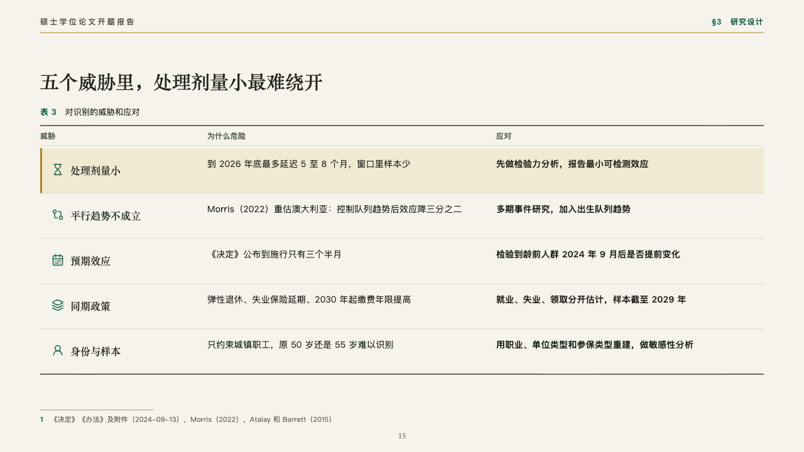
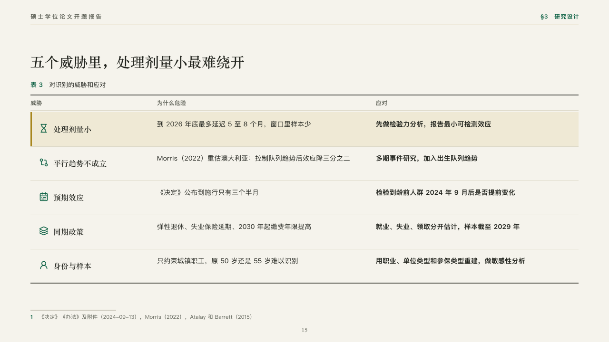

# hazards

Threats to a design and the answer to each.

Code: [`src/layouts/compositions/hazards.tsx`](../../../src/layouts/compositions/hazards.tsx). The header comment there is the contract. The manuscript setting only.

## thesis, retirement age thesis proposal sample, 2026-10

Settled on the threats table (p15). The round's decisions are in [rounds/2026-10-06-thesis](../../rounds/2026-10-06-thesis/README.md).

| board (p15) | engine |
| :-: | :-: |
|  |  |

**What it looks like.** The table's number and title over an open table between two rules of ink: a row a threat, its icon in emerald and its name in the heading serif, why it is dangerous, and the answer in bold. The threat the page is about sits on the pale gold with a gold bar at its left.

**Why.** Each threat is only worth stating with its answer beside it. The lead row says which one the design worries about most: a dose too small to detect.

**What it gave up.**

- Takes a titled `comparison` with a label column, two columns and two to six rows each with an icon, at most one marked.
- A threat's name past one line or a cell past two lines sends the page back.
