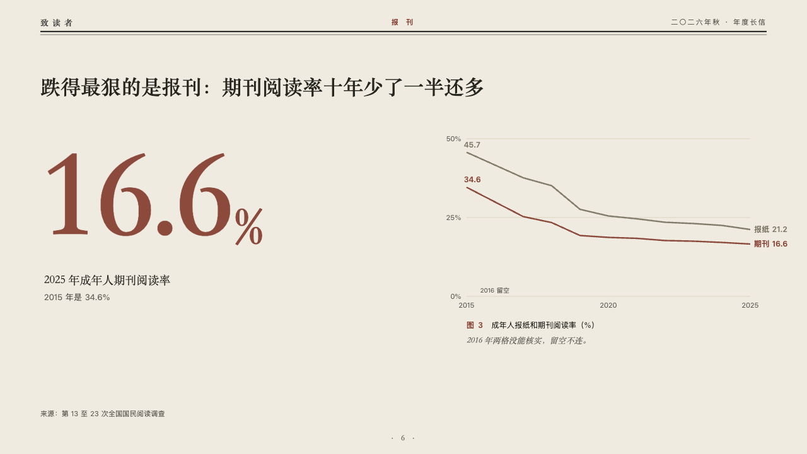
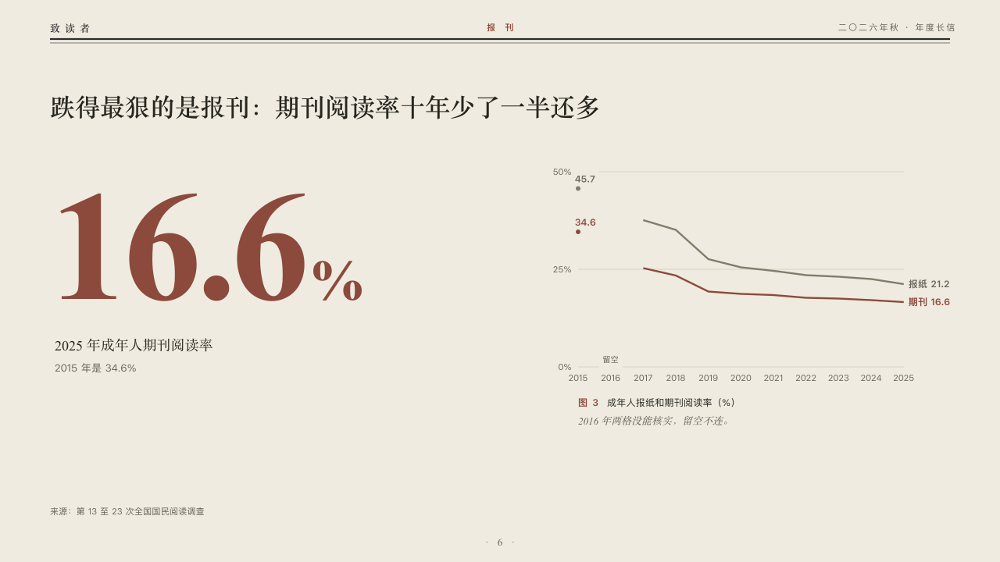

# headline

One figure set huge beside the small trend it ends.

Code: [`src/layouts/compositions/headline.tsx`](../../../src/layouts/compositions/headline.tsx). The header comment there is the contract. The periodical setting only.

## journal, annual letter to readers sample, 2026-10

Settled on p06. The round's decisions are in [2026-10-07-journal](../../rounds/2026-10-07-journal/README.md).

| board (p06) | engine |
| :-: | :-: |
|  |  |

**What it looks like.** The claim over the page. At the left the figure at 200px in the heading serif in brick red, its unit after it a third its size, its label and the line that puts it in context. At the right a small line chart from zero of one to three series, the lead series in brick red and the others in the linen grey, each named with its last value after its end and its first value over its start, a year the author kept open as a break in the lines with its label at the foot, every year under the axis. Under it the figure's number and title and the editor's comment.

**Why.** 16.6% is the number the letter turns on. The small chart says where it came from, and the year nobody could check stays open rather than joined over.

**What it gave up.**

- Takes a `kpi_cards` of one (no symbol, tag, source or direction), a titled `line` chart of one to three series over four to fifteen categories at zero or above, gaps allowed, then optionally a `callout` with words alone.
- Every year is named under the axis and a gap breaks the lines. The board named three years and ran the lines across the gap.
- The hairlines are cut clear of the values on them. A figure past its column, or a category wider than the room between two points, sends the page back.
