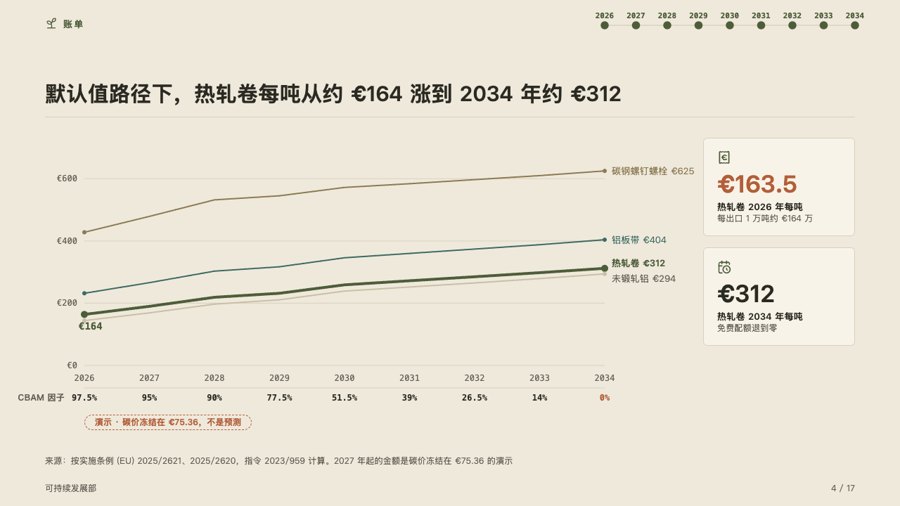
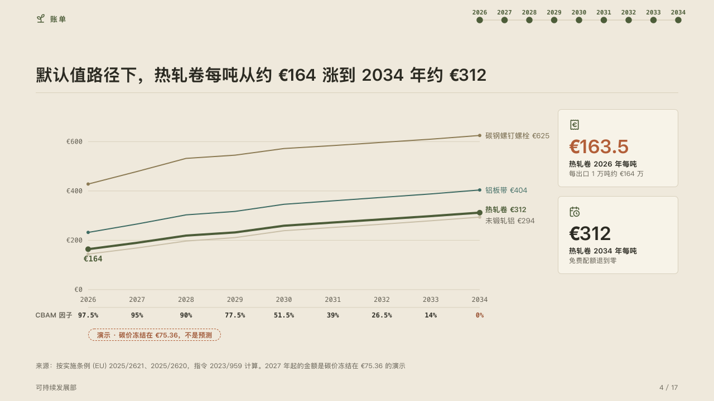

# horizon

Costs followed year by year to the end of a run, over the table of what changes each year.

Code: [`src/layouts/compositions/horizon.tsx`](../../../src/layouts/compositions/horizon.tsx). The header comment there is the contract. The yearbook setting only.

## almanac, CBAM sample, 2026-10

Settled on the long curve page (p04). The round's decisions are in [rounds/2026-10-05-almanac](../../rounds/2026-10-05-almanac/README.md).

| board (p04) | engine |
| :-: | :-: |
|  |  |

**What it looks like.** A line for each series across the years, no frame: hairline gridlines with their values in mono at the left, the years in mono under the plot. The line the page follows (`emphasis` on its series) is heavy in the mark, its first value in mono under its start, moved on below any gridline it would graze. The others step back in the palette's quiet inks and then a ghost. Every line ends in its name and its last value, spread apart where they would meet. Under the years a hairline and the page's `timeline` as a row of the table: its title as the row's name, each milestone's title under its year, the highlighted one in the accent. Under the row the chart's `tag`, the pill that says the amounts are a demonstration. Beside the plot a column of up to three figure cards.

**Why.** The cost rises for nine years because the free share falls, so the share is printed under the years it applies to and the reader can read one against the other without a second chart.

**What it gave up.**

- A `line` chart of two to five series over three to thirteen categories written as years, every series a value at every year, none below zero, and no axis title: the claim says what the lines count. A `timeline` whose milestones are dated by those years, each title one short line. A `kpi_cards` of one to three items.
- A year the chart does not have, a title or a label past its room, or figures taller than the band sends the page back.
- The plot gives way to the widest end label and to the row's name, so it starts about 30px further right than the board's when the row is named 「CBAM 因子」.
